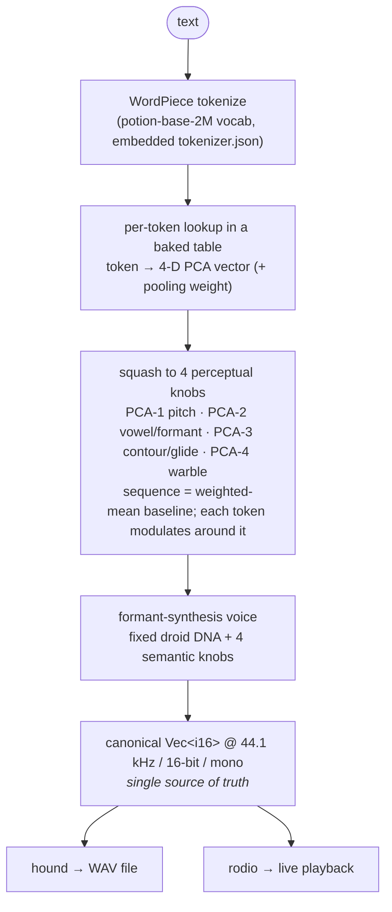

# CLAUDE.md

This file provides guidance to Claude Code (claude.ai/code) when working with code in this repository.

## Project state: pre-implementation

There is **no Rust code yet** — only design documents in `docs/`. The build sequence is
defined task-by-task in `docs/plan.md` (start at **T-01**, workspace scaffolding). Until
the workspace exists, the commands below will not run; they are the project's agreed
tooling (from `docs/style.md` §11) and apply as soon as the crates are scaffolded.

## Source-of-truth documents (read these first)

The design is fully specified. Do not re-derive decisions — consult these, and keep them
in sync with any code you write:

- **`docs/design.md`** — exhaustive rationale for every decision, with full context.
- **`docs/spec.md`** — normative requirements, uniquely identified (`FR-*`, `NFR-*`).
- **`docs/plan.md`** — implementation plan: tasks `T-01…T-57`, dependencies, critical path.
- **`docs/style.md`** — the **mandatory, enforced** Rust style guide. Follow it exactly;
  it is backed by committed tool config and blocking CI.

## What dootdoot is

A Rust CLI that **deterministically** turns text into short bursts of BB-8-like droid
sound. Two properties define the whole design: (1) identical text → identical audio,
bit-for-bit, on every platform; (2) *semantically similar text sounds similar*, so the
output is a learnable sound-language — not random beeps, not speech synthesis.

## Architecture (the big picture)

The pipeline (full detail in `docs/design.md`):



Three crates (a Cargo workspace):

- **`dootdoot-core`** — the **pure, deterministic engine** (functional core): tokenizer
  wrapper, mapping (baked-table load + linear pooling + axis squash), synth, the **owned
  math** module, WAV serialization, `FORMAT_V1` constants. No I/O, no audio device.
- **`dootdoot`** — the **thin CLI shell** (imperative shell): `clap`, stdin, `rodio`
  playback, `--explain`, error/exit-code mapping. Holds essentially all side effects.
- **`xtask`** — **build-time only**, never shipped: generates the baked
  `assets/format_v1.bin` from `potion-base-2M` via `model2vec-rs` (loads embeddings,
  computes the pinned PCA→4 projection, sign-canonicalizes, computes squash stats).

### Load-bearing invariants (violating these breaks the project's core promises)

- **model2vec / `candle` are BUILD-TIME ONLY.** The shipped binary has no tensor
  runtime. The token→4-axis function is precomputed into a ~240 KB table
  (`assets/format_v1.bin`) and the WordPiece `tokenizer.json`, both **committed and
  embedded** (`include_bytes!`). This is sound because PCA projection is linear, so
  sequence pooling on the baked vectors equals pooling-then-projecting.
- **Determinism is bit-exact cross-platform.** No libm transcendentals in the audio
  path — `sin`/`exp`/`tanh` are our own pinned implementations; synthesis is `f64`;
  float→i16 uses one fixed rounding rule; no fast-math/FMA contraction. Any parallelism
  must produce byte-identical output to the serial path.
- **`FORMAT_V1` is a versioned contract.** It bundles everything that affects an output
  sample (model/vocab hashes, PCA matrix, squash stats, all synth constants, math-impl
  version) and is surfaced by `--version`. **Any change that alters even one output
  sample MUST bump the format version** (`V1` → `V2`) and regenerate golden fixtures.
- **Golden-WAV hash tests are the determinism contract** and run cross-platform
  (macOS + Linux) in CI. Treat a golden-hash change as intentional only when paired with
  a `FORMAT` bump.
- **The engine produces one canonical buffer**; file output and playback are sinks of the
  *same* buffer, so what plays equals what's saved.

## Development workflow: red-green TDD

**All changes are implemented test-first, in the red-green-refactor loop. This is
mandatory, not optional.** For every behavior — each `T-*` task in `docs/plan.md`, each
bug fix, each new function:

1. **Red** — write a failing test that pins the desired behavior, and run it to confirm
   it fails *for the right reason* (the assertion, not a compile error or typo).
2. **Green** — write the minimum code to make that test pass; run the test to confirm.
3. **Refactor** — clean up code and tests with the suite green, re-running to stay green.

Guidance specific to this project:

- **The architecture exists to make this easy.** The functional core (`dootdoot-core`)
  is pure and deterministic, so tests are plain value assertions; effects are behind
  injected traits, so the shell is tested with fakes. If a test is hard to write, fix the
  design, don't skip the test.
- **Write the test at the right level** (see `docs/style.md` §9): unit/value tests for
  pure logic, `proptest` for invariants, `insta` snapshots for structured output, and
  golden-WAV hash tests for the determinism contract. Reach for the cheapest level that
  pins the behavior.
- **Determinism work is inherently test-first:** assert the golden hash / property
  first, then implement until it holds. A golden-hash change is legitimate only when
  paired with a `FORMAT` bump (see above).
- **One red-green cycle ≈ one revision.** Each `jj` revision should land a coherent
  test-plus-implementation step (see Version control below).

## Version control

This repository uses **`jj` (Jujutsu)** for version control (colocated with a `.git`
backend). Use `jj`, not `git`, for VCS operations.

**Segment all work into small, well-described individual revisions.** Each revision
should be a single coherent change with a clear description (a concise imperative
summary line; add a body explaining the "why" when it isn't obvious). Prefer many small,
focused revisions over one large one — e.g. align work to the individual `T-*` tasks in
`docs/plan.md`. Keep each revision self-contained and, where practical, independently
reviewable.

## Commands (per `docs/style.md` §11; available once the workspace is scaffolded)

```bash
# Run
cargo run -p dootdoot -- "hello there"        # play live
cargo run -p dootdoot -- "hi" -o hi.wav       # write WAV (no playback)
cargo run -p dootdoot -- "hi" -o hi.wav --play

# Test (includes doctests)
cargo test
cargo test -p dootdoot-core                    # one crate
cargo test -p dootdoot-core <test_name>        # a single test by name

# Format — NIGHTLY rustfmt is required (the rustfmt.toml uses nightly-only options);
# build/test stay on pinned stable.
cargo +nightly fmt
cargo +nightly fmt --check                      # CI gate

# Lint — warnings are errors in CI
cargo clippy --all-targets -- -D warnings

# Coverage (threshold ≥95% on dootdoot-core)
cargo llvm-cov

# Dependency hygiene
cargo deny check
cargo machete

# Regenerate the baked asset (only when intentionally changing the mapping → FORMAT bump)
cargo run -p xtask
```

## Conventions that most affect how you write code here

These are the highest-impact rules from `docs/style.md` — read the full guide before
writing code, but at minimum:

- **Functional core / imperative shell.** All logic is pure and lives in
  `dootdoot-core`; effects live behind injected traits in the binary. This is what makes
  ~99% of code deterministically testable — preserve it.
- **`forbid(unsafe_code)` workspace-wide.** `as` casts are forbidden for numeric
  conversions (use `From`/`TryFrom` or the named quantization helper). No reliance on
  `HashMap` iteration order — use `BTreeMap`/`Vec` or sort before output.
- **File layout:** one primary construct per file, named after it, namesake at the top;
  files ordered top-to-bottom by relevance (public first); no `mod.rs`. Complex tests go
  in a sibling `<namesake>/tests.rs`; black-box tests in top-level `tests/`.
- **Public API is a curated facade:** modules are private (`mod foo;`); the crate root
  re-exports the supported surface via `pub use`. Don't leak dependency types
  (`hound`/`rodio`/`tokenizers`) across public boundaries.
- **Docs:** every public item has a one-sentence summary + optional context paragraph
  (`deny(missing_docs)`); `# Errors`/`# Panics`/`# Safety` where applicable; doctests on
  non-trivial public API.
- **Errors:** `thiserror` in libraries, `anyhow` only in the binary; no `unwrap` outside
  tests; panics only for true invariants, never for bad input.
