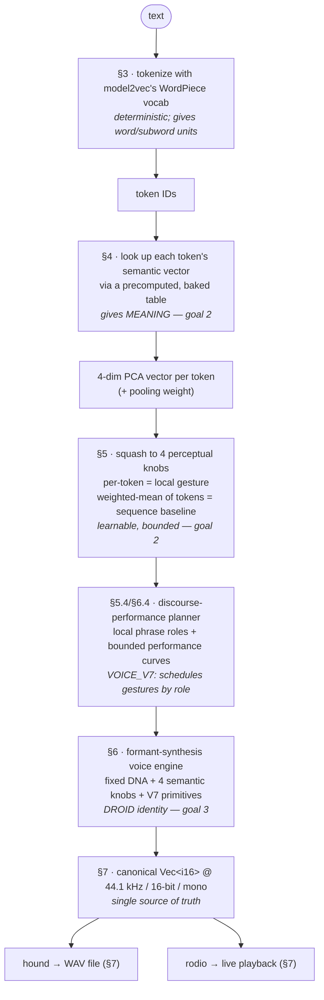

# dootdoot — Design Document

> Status: design complete, pre-implementation. This document is the authoritative
> rationale for every design decision. The normative requirements derived from it
> live in [`spec.md`](./spec.md); the build sequence lives in [`plan.md`](./plan.md).

---

## 1. Overview

**dootdoot** is a command-line application, written in Rust, that **deterministically**
turns text into short bursts of synthesized sound reminiscent of **BB-8**, the
astromech droid from the sequel-trilogy Star Wars films.

It is not a text-to-speech system and not a random "beep generator." It is a
**deterministic, semantically-aware sound language**: the same text always produces
the same audio, and _semantically similar text produces audibly similar sound_. A
user can, over time, learn to associate sonic gestures with meaning — to develop an
intuition for the "language."

### 1.1 Goals

1. **Determinism.** Identical input text yields identical audio output, bit-for-bit,
   forever (subject to an explicit, versioned voice contract). The design targets every
   platform; the v1 _guarantee_ covers the CI-verified ones, macOS and Linux (§8.1).
2. **Semantic similarity → sonic similarity.** Semantically similar tokens _and_
   semantically similar token sequences sound similar. This is what makes the output
   a learnable language rather than noise.
3. **Droid identity.** The output is unmistakably a droid in the BB-8 family —
   warm, warbly, vocal-but-not-human — regardless of the input text.

### 1.2 Non-goals

- Intelligible speech / TTS. The droid does not pronounce English words. The `VOICE_V7`
  code-talkbox mouth stage (§6.2) is deliberately broad and subtle — droid articulation, not
  phoneme-accurate speech — and never maps English phonemes to audio.
- Real-time interactive performance / DAW plugin. It is a batch CLI.
- Multi-language excellence. v1 is English-oriented (see §10).
- User-tunable synthesis in v1. The mapping is intentionally fixed (that fixedness
  is what makes the language learnable and shareable). Later voice versions add more
  performance channels, but all are deterministic, bounded, and a pure function of the
  text — not user knobs.

---

## 2. The core idea and how the decisions hang together

The design is a single pipeline. Each stage was chosen to serve one or more of the
three goals, and later stages depend on earlier ones. The dependency chain:



From `VOICE_V7` on, a **deterministic discourse-performance planner** sits between the
semantic layer and synthesis (§5.4, §6.4): it segments the token/control-event stream into
local phrases, assigns each a role, and emits bounded continuous performance curves that
schedule the expanded synthesis primitives. It is a pure function of the text and does not
touch the learnable four-axis semantic core.

The determinism guarantee (§8) wraps the whole pipeline; the runtime architecture
(§9) is shaped by the decision to precompute the semantic mapping at build time.

---

## 3. Text → tokens

### 3.1 Decision: map on a per-token basis (not per-character, per-word, or whole-string)

We map sound on the unit of **tokens** produced by a subword tokenizer.

**Why not the alternatives:**

- _Per-character_ gives legible length but no semantics and a robotic monotony at the
  character grain.
- _Per-word_ is closer but cannot represent sub-word meaning or rare words gracefully.
- _Whole-string hash_ throws away all internal structure and makes "longer/related
  text → related sound" impossible.

A subword tokenizer gives us, for free, a desirable cadence property: **frequent
words become a single token (one compact syllable), while rare or long words split
into multiple sub-tokens (a longer, multi-syllable utterance).** This mirrors how
BB-8 speaks in bursts of varying length, and it is the natural unit at which semantic
vectors are available (§4).

### 3.2 Decision: use model2vec's tokenizer (WordPiece), not tiktoken / cl100k_base

During design we first considered `tiktoken` + `cl100k_base` (the GPT-4 encoding),
because it is purpose-built for text→token-IDs, ships a frozen embedded vocab, and is
trivially deterministic. **We rejected it** once goal 2 (semantic similarity) was
made explicit, for a decisive reason:

> **BPE token IDs are not semantic.** In `cl100k_base`, IDs are assigned by merge
> order / frequency. ID 4922 and ID 4923 have no meaning relationship. OpenAI does
> not publish an embedding matrix for `cl100k_base`, so there is no offline way to
> recover semantics from those IDs.

To make "cat" and "dog" sound similar, we need a tokenizer that comes _with_ public
semantic vectors. That is `model2vec` (§4), whose vocabulary is a **WordPiece** vocab
(~30k tokens) inherited from its distillation source. Adopting model2vec for
semantics therefore also fixes the tokenizer choice.

**Consequences we accept:**

- WordPiece marks subword continuations (e.g. `play` + `##ing`), which we exploit for
  word-boundary timing (§6.4).
- The base model is (almost certainly) **uncased**, so `Hello` and `hello` tokenize
  — and therefore sound — identically. This is documented behavior, not a bug.

### 3.3 Tokenizer configuration

- **Injected special tokens disabled** (`add_special_tokens = false`): BERT-family
  `[CLS]`/`[SEP]` carry no meaning for us and would inject phantom syllables.
- **Control-token filter (covers literal input too).** `add_special_tokens = false` only
  stops _injected_ markers; a user can still type the literal text `[CLS]`, `[MASK]`, etc.,
  which WordPiece resolves to a single registered special-token ID. We therefore apply an
  explicit **drop filter** after tokenization, by token ID, against a fixed set:
  **`[PAD]`, `[CLS]`, `[SEP]`, `[MASK]`** (resolved from the tokenizer JSON embedded in
  the `.doot` asset's registered specials). Filtered tokens are removed entirely — not
  voiced, not counted as syllables — exactly like prosodic punctuation (§6.4). The set is
  frozen in `VOICE_V1` (§8.2).
- **`[UNK]` is the deliberate exception** — it is **not** in the filter. WordPiece falls
  back to `[UNK]` for unrepresentable input; it has its own embedding, so it produces a
  consistent "unknown" warble. We keep it: deterministic and on-theme ("the droid doesn't
  know that word").
- **Dash/ellipsis hesitation markers (`VOICE_V7`).** Standalone `-`, `--`, en dash (`–`),
  em dash (`—`), and the single-character ellipsis (`…`) are treated as **control-only
  hesitation markers**, not voiced semantic tokens: they carry no four-axis values, attach
  a quiet, bridge-suppressed hesitation rest to the **preceding** syllable (like prosodic
  punctuation, backward-only), and appear as a distinct control row in `--explain`. A
  three-dot `...` still tokenizes to three `.` periods and routes through the existing
  control-only period path.
- **Empty after filtering** → treated as empty input: the inquisitive "?" chirp (§7.4).
  (E.g. input that is only `[PAD]`.)
- The tokenizer is driven by the model's `tokenizer.json`, carried inside the embedded
  `.doot` runtime asset.

---

## 4. Tokens → semantics (the meaning layer)

### 4.1 Decision: source semantics from model2vec (`potion-base-8M`)

`model2vec` distills a sentence-transformer into a **static embedding lookup table**:
every token maps to a fixed semantic vector, and `model2vec.encode()` embeds a whole
sequence by mean-pooling the token vectors and then **L2-normalizing** the result
(`potion-base-8M` ships `normalize: true`). This is an ideal fit:

- **Deterministic** — a frozen lookup table plus a fixed pooling rule is a pure function.
- **Semantic at both levels** — token-level _and_ sequence-level similarity are
  meaningful (satisfies both halves of goal 2). dootdoot derives its sequence baseline
  from the same per-token vectors via its **own** pooling rule (§4.2), which intentionally
  drops the L2 step; the goal is _audible relative similarity_, not byte-equivalence to
  `model2vec.encode()`.
- **Offline / embeddable** — a small `safetensors` file, read only at build time.
- **Rust-native** — `model2vec-rs` exists and is maintained.

**Model choice:** `potion-base-8M` (~7.6M parameters, **~256-dim** vectors). Because the
model is a **build-time-only input** (§4.2) — projected to 4 PCA axes and baked into the
~300 KB table, never loaded at runtime — source size costs nothing in the shipped binary
or at runtime, so we pick for _semantic quality_, not footprint. `8M` (avg MTEB ≈ 51)
materially out-scores the tiny `2M` (≈ mid-40s): its 256-dim embeddings give the top-4 PCA
a richer, better-conditioned space to draw from, which directly strengthens the
similarity property the whole language rests on (goal 2; tested by NFR-14/15). We stop at
`8M` rather than `32M` because the gain to `32M` is marginal (≈ 52) while its source is
larger to process — and everything downstream (4 axes → bounded knobs → droid voice) is a
lossy funnel that caps how much extra source fidelity is audible. The 4-axis reduction
keeps the artifact tiny regardless of source dimensionality.

**Source dtype.** Upstream `minishlab/potion-base-8M` currently publishes **F32**
`safetensors`. dtype is irrelevant to the shipped binary — the model is a build-time
input only (§4.2) and is never embedded. `xtask` reads whatever the upstream weights are,
projects to 4 axes, and writes dootdoot's **own int16-quantized** records into
`dootdoot_asset_v1.doot` (§4.2); nothing relies on the source being pre-quantized.

**Rejected alternatives:** GloVe/word2vec (word-level only, large), fastText (heavier,
older), and running a full transformer at runtime via `candle` (unnecessary weight —
see §9).

### 4.2 Decision: model2vec is a BUILD-TIME dependency only

The function `token → semantic vector → 4 PCA axes` is **frozen** under the dootdoot
asset spec and the voice contract (§8). Therefore it can be **precomputed once, offline,
for the entire ~30k-token vocabulary**, and shipped as a tiny lookup table. The runtime
never loads model2vec or a tensor framework.

This works because **PCA projection is linear**, so projection commutes with the
weighted mean. In exact arithmetic, pooling the baked 4-dim vectors equals pooling the
original 256-dim vectors and then projecting:

```
project(mean_w(token_vectors)) == mean_w(project(token_vectors))
```

(`mean_w` = the weight-scaled mean defined below; weights are baked per token.) This is
what lets us pool _after_ baking the projected vectors instead of shipping the 256-dim
table. The identity is exact **before quantization**; we store the projected vectors as
int16, which introduces a small, bounded rounding error, so the precise runtime guarantee
is: _the runtime pools the frozen quantized approximation, deterministically._ The
quantization is part of the `VOICE_V1` contract (§8.2), so the approximation is identical
on every run and on every verified platform (§8.1).

**The sequence baseline is dootdoot's own pooling, not `model2vec.encode()`.** The
identity above commutes the _projection_ with the mean — it does **not** reproduce
model2vec's sequence embedding, because `model2vec.encode()` mean-pools and then
**L2-normalizes** the pooled vector (`potion-base-8M` has `normalize: true`). That final
normalization is nonlinear and does **not** commute with the PCA projection, so it cannot
be recovered from the baked 4-dim per-token vectors alone. The blocker is the norm of the
_pooled_ high-dimensional vector: `‖mean(x_i)‖² = (1/n²) Σ_i Σ_j ⟨x_i, x_j⟩`, which
depends on the full **pairwise dot products** between the original 256-dim token vectors,
not on any per-token quantity. **A per-token scalar norm cannot reconstruct it** (the
cross-token terms `⟨x_i, x_j⟩`, `i ≠ j`, are irreducibly pairwise) — so there is no
"cheap" way to bake the L2 step back in; reproducing it would mean carrying the full
~15 MB+ 256-dim table (~30k × 256 × int16) at runtime to recompute those dot products,
which we deliberately dropped. dootdoot therefore defines its **own** sequence baseline in
PCA space and skips the L2 step entirely. The pooling rule is the token-weight-scaled mean
over the `n` tokens:

```
baseline_pre = (1 / n) · Σ_i (w_i · v_i)      // v_i = dequantized 4-dim token vector,
baseline     = squash(baseline_pre)            // w_i = dequantized pooling weight
```

The denominator is the **token count `n`** (matching `model2vec-rs`'s pre-normalization
pooling, which divides the weight-scaled sum by token count), _not_ `Σ_i w_i`. This is a
deliberate, documented divergence: the baseline is a _dootdoot-specific, model2vec-derived_
PCA-space pool. It preserves coarse semantic continuity for the "mood" baseline (goal 2,
sequence half; verified by NFR-15) while keeping the runtime artifact tiny and tensor-free.
The exact rule (denominator, the skipped L2 step) is part of `VOICE_V1` (§8.2).

**Quantization scheme (deterministic, lossy by a bounded amount).** The scheme is
**symmetric, signed, zero-point-free** — no min/max offset — so that the linear pooling of
§4.2 carries over to the integer domain unchanged (a zero-point would make the dequantized
mean depend on token count). Per axis `k`:

- _Scale selection (build time)._ `s_k = max_t |p_{k,t}| / 32767`, where `p_{k,t}` is the
  projected value of token `t` on axis `k` over the whole vocab. Dividing by **32767**
  (not 32768) keeps the usable code range **symmetric** at `[−32767, 32767]`; the code
  **−32768 is never emitted** (reserved/unused), so negation and the symmetric range are
  exact.
- _Quantize._ `q = clamp(round_half_to_even(p / s_k), −32767, 32767)`, stored as `int16`.
  Rounding ties go to **even** (banker's rounding), the one rule used everywhere (it is the
  same tie rule as the float→i16 audio step, §8.2). The `clamp` only ever engages on the
  exact per-axis maximum, which maps to ±32767 by construction.
- _Dequantize (runtime)._ `p̂ = q · s_k` in f64. Max per-axis error is `s_k / 2`.

Pooling weights use the **same** symmetric rule with their own scale `s_w`. Weights are
non-negative, so in practice only `[0, 32767]` is populated; the rule is identical (no
special unsigned encoding) to keep one code path. `s_w = max_t w_t / 32767`.

All five scales (`s_1..s_4`, `s_w`) live in the `.doot` asset as f32 and are part of
`VOICE_V1` (§8.2). The nonlinear "squash" (§5.3) is **never baked**; it is applied at
runtime after pooling (for the baseline) and after per-token lookup (for gestures), so it
operates on the dequantized values and the linearity argument holds up to int16 rounding.

**Dootdoot asset spec (`.doot`) layout and size.** The runtime asset is a Protocol
Buffers message, `assets/dootdoot_asset_v1.doot`, that accumulates the tokenizer JSON and
the semantic mapping into one committed file. Its fields include the asset spec version,
vocab size, axis count (4), the 4 axis dequant scales + the weight dequant scale (f32
each), the per-axis squash statistics (§5.3), the model-, tokenizer-, and PCA-matrix
hashes (§8.2), the complete tokenizer JSON, and a compact `token_records` bytes field.

Each token record inside `token_records` is still 10 little-endian bytes: 4 × int16
(quantized PCA components) + 1 × int16 (quantized pooling weight). The `.doot` file is
roughly **1 MB** because it contains the ~300 KB mapping records plus the tokenizer JSON.
The upstream F32 model embeddings are a build-time input only and are not shipped.

The runtime asset stores the **projected** values, so it does **not** carry the 256→4 PCA
matrix; that matrix is a build-time artifact, recorded in the contract only by hash for
provenance.

**Source manifest (reproducible regeneration).** A mutable model _name_ is not a
reproducible input: `minishlab/potion-base-8M` could be re-uploaded and silently change
what `xtask` ingests. The `VOICE_V1` model hash catches such drift _after_ generation
(the baked output would no longer match the committed artifact), but it does nothing to
make regeneration itself reproducible. So the source is pinned by a committed
**`assets/source_manifest.toml`**, the immutable contract for what `xtask` consumes:

- **`hf_repo`** — `minishlab/potion-base-8M`.
- **`revision`** — the exact immutable commit SHA (not a branch/tag).
- **`model_sha256`** / **`tokenizer_sha256`** — expected hashes of `model.safetensors` and
  `tokenizer.json`.
- **`hidden_dim = 256`**, **`normalize = true`**, **`dtype`** (the upstream F32) — the
  structural expectations the rest of the pipeline relies on.

`xtask` **validates the downloaded/vendored files against this manifest before computing
or writing anything** (matching revision, byte-hashes, and the structural fields), and
aborts on any mismatch. This makes "regenerate the asset" deterministic and reviewable:
two runs from the same manifest produce byte-identical `dootdoot_asset_v1.doot`. The
manifest is committed alongside the asset (§9.3); the model hash it pins is the same one
recorded in `VOICE_V1` (§8.2), so the build input and the runtime contract cannot
silently diverge.

See §9 for the resulting runtime/build-time split.

---

## 5. Semantics → perceptual axes (the learnable layer)

### 5.1 Decision: reduce ~256 dims to exactly 4 axes via pinned PCA

256 dimensions are neither audible nor learnable. We collapse them to a **small, stable,
perceptually meaningful** set.

**Mechanism: pinned PCA.** Offline, we run the entire vocab through PCA, keep the top
**K = 4** principal components, apply the fixed projection matrix to every token vector,
and **bake the already-projected 4-axis values** into the `.doot` asset. At runtime the
engine only _looks up and dequantizes_ these projected values (§4.2) — it never applies
the PCA matrix, which is not shipped (recorded in the contract by hash only).

**Why PCA over alternatives:**

- _Random projection_ is deterministic but produces arbitrary axis mixtures with no
  salience ordering — much harder to learn by ear.
- _Hand-picked semantic anchors_ (`hot−cold`, `big−small`) are maximally interpretable
  but subjective and labor-intensive. We may _optionally_ use anchor words later to
  _label_ the discovered PCA axes for documentation, but PCA does the heavy lifting.

PCA's key virtue for goal 2: it **orders axes by how much real semantic variation they
carry**, so axis 1 is the single most salient meaning-direction — the first thing a
listener's ear learns.

**Why K = 4:** 1–2 axes collapse too many words together; 6+ axes overwhelm a listener.
3–4 is the sweet spot; 4 gives enough expressive knobs for a believable droid voice.

### 5.2 Decision: which axis drives which perceptual knob

Axes map to knobs in **variance order**, so the most salient knob carries the most
salient semantic split:

| Axis  | Knob                       | Range / meaning                        |
| ----- | -------------------------- | -------------------------------------- |
| PCA-1 | **Pitch center**           | low ↔ high (most perceptually obvious) |
| PCA-2 | **Vowel/formant position** | `ee ↔ ah ↔ oo` (meanings "say" vowels) |
| PCA-3 | **Contour / glide shape**  | falling-swoop ↔ rising-swoop           |
| PCA-4 | **Warble depth**           | steady ↔ heavy burble                  |

PCA-2 maps to **vowel position** rather than generic brightness/lowpass deliberately:
it is both more authentically BB-8 (the real voice was a vowel-formant synth, §6.1)
and more learnable (the ear maps meaning to vowel color).

### 5.3 Decision: bounded squash applied post-pooling

PCA outputs are unbounded. Each axis is squashed into a fixed perceptual range using
**frozen per-axis statistics** computed offline over the vocab (e.g. percentiles or
mean/std).

**The squash function is chosen at asset-generation time, not at the end of tuning.** The
function (tanh vs percentile-clamp) determines which statistics the `.doot` asset must
carry, so it cannot be deferred past the point where `dootdoot_asset_v1.doot` is produced.
The build pipeline reflects this: the squash function is selected when squash stats are
computed (plan task T-15), and any later adjustment during voice tuning (T-46)
**regenerates the asset** before the `VOICE_V1` freeze (T-48). Because the squash is
applied at runtime and is _not_ baked into the per-token vectors, a change touches only
the asset's squash statistics, so regeneration is cheap. Whatever is frozen becomes part
of `VOICE_V1` (§8.2).

Squash is applied in two places, consistently, on the dequantized values:

- **Per token** → the token's local gesture knob values.
- **On the sequence baseline** (the token-weight-scaled mean defined in §4.2, denominator
  = token count, no L2 normalization) → the utterance baseline.

### 5.4 Decision: two-level application (sequence baseline + per-token modulation)

- The **pooled sequence vector** sets the _baseline/center_ of each of the 4 knobs for
  the whole utterance — the phrase's overall "mood." This is what makes _semantically
  similar sequences_ sound similar (goal 2, sequence half).
- Each **token's vector** modulates _around_ that baseline — the local gesture. This is
  what makes _semantically similar tokens_ sound similar (goal 2, token half).

**Exact assembly formula.** All four knobs are combined in _squashed knob space_, where
every term is already inside the bounded per-axis range `[lo_k, hi_k]` produced by the
squash (§5.3). For axis `k`, token `i`:

```
B_k       = squash_k(baseline_pre_k)            // baseline knob (center), in [lo_k, hi_k]
T_{i,k}   = squash_k(v_{i,k})                    // per-token knob,        in [lo_k, hi_k]
knob_{i,k} = clamp( B_k + α_k · (T_{i,k} − B_k), lo_k, hi_k )
```

- `baseline_pre` and `v_i` are the **dequantized PCA-space** vectors (§4.2); squash is
  applied to each _before_ combining, so both `B_k` and `T_{i,k}` are bounded.
- The per-token knob is treated as an **absolute** value; its contribution is the
  **delta** `(T_{i,k} − B_k)`, scaled by a fixed per-axis **modulation depth** `α_k`.
  `α_k = 0` yields a flat baseline-only reading; `α_k = 1` yields the pure per-token knob.
- `α_k` is a frozen `VOICE_V1` constant (one per axis). For `α_k ∈ [0, 1]` the result is
  a convex combination of two in-range values and the `clamp` is a no-op; the `clamp` is
  retained so that any `α_k > 1` (gesture exaggeration) still cannot escape `[lo_k, hi_k]`,
  preserving the bounded droid parameter space (NFR-16) unconditionally.
- A single-token utterance has `B_k = T_{0,k}`, so `knob = B_k` regardless of `α_k`.

The `α_k` vector, the per-axis `[lo_k, hi_k]` bounds, and the final clamp are all part of
`VOICE_V1` (§8.2).

`VOICE_V1` freezes `α = [0.85, 0.90, 1.10, 1.20]` in pitch/vowel/contour/warble order.
All four squashed knob axes use bounds `[-1.0, 1.0]`.

### 5.5 Decision: `VOICE_V7` adds a performance layer above the meaning layer

The four semantic knobs remain the **learnable core**. `VOICE_V7` adds a separate
**performance layer** that shapes _how_ a syllable is delivered without changing _what_ it
means. After tokenization and mapping, a pure **discourse-performance planner** (§6.4)
segments the voiced syllables into local phrases by punctuation and hesitation timing,
assigns each phrase a role (`probe`, `chatty_reply`, `hesitation`, `terminal_flourish`,
`aside`), and emits bounded continuous **performance curves** per syllable: pitch
center/velocity, formant target/velocity, brightness pressure, mouth openness, and
archetype tension/release. These curves drive the expanded synthesis primitives (§6.2) and
the role-gated timing (§6.4).

Affect and archetype are **localized**: the utterance still has a single pooled mood row,
but archetype selection and gesture intensity are chosen per role/syllable, so a
high-arousal utterance no longer collapses into one global Yelp — whistle and yelp are
reserved for the opener and the terminal accent while the middle rotates
chatter/stutter/tremble. Every curve is clamped to a fixed range and is a pure function of
the text, so NFR-16's bounded droid parameter space holds. Neutral curves reproduce
`VOICE_V6` exactly, so the empty chirp and any non-planned syllable are unchanged.

---

## 6. Perceptual axes → sound (the droid voice)

### 6.1 What actually makes BB-8 sound like BB-8 (research basis)

BB-8's voice (Star Wars: The Force Awakens) was created by J.J. Abrams playing the
**Bebot "Robot Synth"** iPad app — an X/Y touch synth whose signature is **vocal
formant filtering** with **expressive pitch slides** (dragging across the pad) — and
running its output through a **hardware talkbox** operated by Bill Hader, which
imposed a _second_ layer of human vowel/consonant formants. Takes that "sounded too
human" were rejected.

The defining acoustic ingredients, in priority order:

1. **Formants / vowel resonances** — the dominant identity. Moving formant peaks make
   the sound articulate vowel-like shapes (`ee→ah→oo`), so it reads as "talking"
   without being intelligible. Present _twice_ in the original (Bebot's vocal filter +
   the talkbox).
2. **Continuous pitch glides (portamento)** — BB-8 _swoops_ between pitches rather than
   stepping. This is the emotional, singing quality.
3. **High-ish, deliberately non-human pitch register** — cute and bright, kept out of
   the human speech band.
4. **Warble / vibrato** from the live performance.
5. A faint **electronic edge** so it never sounds fully organic.

**This rules out FM or ring-mod as the _core_.** They were considered, but the core
must be **formant synthesis**; ring-mod survives only as a faint seasoning.

> Sources: Time, SlashFilm, GamesRadar coverage of the BB-8 voice; Loopy Pro forum
> identifying the app as Bebot; Bebot "Robot Synth" by Normalware (App Store).

### 6.2 Decision: synthesis method = formant-core with portamento

The fixed voice per token gesture (the **droid DNA**) is a **signal graph**, not a single
serial chain: a _control layer_ computes the instantaneous pitch, which drives the
_audio path_. Implementation order follows the data flow:

**Control layer (modulators → instantaneous pitch).** Combined first, evaluated per
sample, they yield the oscillator frequency:

- **Pitch center** — base frequency, set by PCA-1, biased into a high register.
- **Portamento** — the center **glides** smoothly between consecutive token gestures
  rather than jumping (the BB-8 swoop). Glide time is fixed; contour shape steered by
  PCA-3.
- **Warble LFO** — a fixed-_rate_ vibrato added to the pitch; _depth_ steered by PCA-4.

**Audio path (source → filter → modulation → amplitude).** Driven by the pitch above:

1. **Harmonically-rich source** — band-limited sawtooth/pulse whose oscillator phase is
   advanced by the control-layer pitch (formants need harmonics to sculpt).
2. **Formant filter bank** — 2–3 resonant bandpass filters at vowel frequencies. This
   _is_ the talkbox/Bebot identity. Vowel position is steered by PCA-2.
3. **Faint ring-mod** at a fixed frequency, low mix — the electronic edge.
4. **Amplitude envelope** — fixed snappy attack/decay per syllable.

So the actual graph is: `(pitch center + portamento + warble) → oscillator/source →
formant bank → ring-mod → amplitude envelope`. The earlier "portamento/warble as later
stages" framing was about _which axis controls what_, not signal order; pitch modulation
necessarily happens at the oscillator, upstream of the formants.

**`VOICE_V7` expanded primitives.** V7 widens the instrument's dynamic range with bounded,
deterministic additions that the performance planner (§5.5, §6.4) schedules by role; with
neutral curves they are inert, so the V6 graph is unchanged:

- **Swept-oscillator whistle gesture** — for terminal-flourish accents the **oscillator
  fundamental itself** (not just the sparkle layer) sweeps up into the 2–4 kHz whistle band,
  using a **wider per-gesture pitch span** so selected events leave the established
  ~0.5–1.1 kHz register.
- **Noise/breath excitation** — a deterministic value-noise source is blended under the
  tonal oscillator for selected gestures, so harmonicity can swing clean→rough within a
  gesture; ordinary syllables stay cleanly periodic.
- **Event-based upper-mid sparkle** — the formerly always-on sparkle becomes a
  brightness-reserved event with a shaped attack/decay, louder on flourishes than on
  ordinary chatter; the global brightness floor is **not** raised.
- **Code-talkbox mouth stage** — an optional broad moving mouth filter (2–4 resonances)
  after the formant bank, with a deterministic open/close envelope, tongue/front-back curves,
  optional breath excitation, and mild bounded saturation. Off by default; opened by the
  planner on inquisitive holds, moans, and flourishes.
- **Deterministic imperfection** — a small bounded (±6 cents) per-gesture tape-speed detune
  for organic life, gated to zero on neutral curves.

The graph with V7 is: `(pitch center + portamento + warble + whistle sweep + imperfection)
→ oscillator/source + noise/breath → formant bank → ring-mod → mouth stage → amplitude
envelope`, with the event-based sparkle/body layers mixed in before ring-mod.

### 6.3 Decision: the fixed/variable split (guarantees droid identity)

- **Fixed (the DNA, identical for all input):** formant _character_ (the filter
  structure and vowel locus), portamento glide time, warble _rate_, ring-mod frequency
  and mix, envelope shape, high-register bias, source waveform.
- **Variable (the 4 semantic axes only, in `VOICE_V1`):** pitch center, vowel position,
  contour/glide shape, warble depth.

Because only 4 tasteful, bounded knobs move and everything else is constant, **every**
`VOICE_V1` output is unmistakably the same droid (goal 3), while the knobs carry meaning
(goal 2).

`VOICE_V2`–`VOICE_V7` broaden the _variable_ set with additional **deterministic, bounded**
performance channels (affect, complexity, archetype, phrase prosody, and the V7
planner-driven primitives above), but every one is clamped to a fixed range and is a pure
function of the text. The droid-family identity is preserved by the fixedness of the
_bounds_, not by the literal count of moving parameters (the broadened NFR-16; §8.3, §5.5).

### 6.4 Decision: temporal / rhythmic structure

- **One token = one syllable** — a single continuous formant-glide warble (not a
  cluster of discrete beeps). `VOICE_V1` ships a single **fixed** base duration
  (~170 ms) as a V1 implementation choice for a regular, learnable rhythm — but this is
  **not** a hard requirement (the original FR-20 fixing it has been removed). Duration is
  _not_ a fifth **semantic** axis (it does not encode token meaning), yet deterministic,
  structure- or affect-driven duration variation (phrase-final lengthening, complexity-
  or mood-driven pacing) is permitted and explored in
  [`bb8-expressiveness-gap-analysis.md`](./research/bb8-expressiveness-gap-analysis.md).
- **Within a word, syllables glide together** — consecutive subword tokens of the same
  word (detected via WordPiece `##` continuation marking) are connected by portamento
  with **no silence**, so a multi-token word sounds like one flowing multi-syllable
  utterance (`playing` = two glided syllables). Word length becomes audible.
- **Between words, a short pause** (`VOICE_V1`: ~110 ms) — the burst-like BB-8 cadence;
  lets the ear segment words. The pause need not be a single fixed constant (revised
  FR-22): deterministic variation by boundary strength (word vs clause vs sentence) is
  permitted; `VOICE_V1` uses one fixed value. `VOICE_V3` keeps the deterministic word
  boundary duration but fills it with a quiet pitch/formant transition bridge so normal
  phrases flow instead of becoming hard-separated token bursts.
- **Punctuation is control-only, not voiced.** A fixed set of prosodic punctuation
  tokens (`.` `!` `?` `,` `;` `:`) is recognized and treated as control markers: they do
  **not** produce their own syllable. Instead each shapes the **preceding** syllable's
  final glide and inserts a pause: `?` → rising final glide + longer pause; `.`/`!` →
  falling final glide + longer pause; `,`/`;`/`:` → medium pause, no contour change. They
  therefore do not add to the voiced-syllable count. Any other symbol that is _not_ in
  this prosodic set is voiced as a normal token (it has its own embedding and gesture).
  In `--explain`, prosodic punctuation appears as a distinct control row (e.g.
  `. → falling glide + pause`), separate from the per-token knob rows.
- **Punctuation with no preceding syllable.** A prosodic marker attaches **backward
  only** — it never attaches forward, so it cannot create a syllable that wasn't already
  there. Concrete rules, all deterministic:
  - **No voiced syllable yet** (leading punctuation: `? hello`, or input that is _only_
    punctuation: `?`, `!!!`): the marker has nothing to shape, so it is a **no-op for
    glide** — it is simply dropped. Its pause is also dropped (leading silence is already
    handled by the fixed padding).
  - **Input that contains no voiced syllables at all** (e.g. `?`, `!!!`, `. , ;`): after
    dropping every control marker, **zero** syllables remain, which is the empty case →
    the fixed inquisitive **"?" chirp**, exit 0 (§7.4). This is why the golden corpus's
    bare `"?"` (plan T-49 corpus) maps to the chirp, _not_ to a voiced glyph.
  - **Consecutive markers** after a syllable (`hi?!`, `wow...`): only the **first** marker
    shapes that syllable's final glide; the rest contribute only to the (single, not
    additive) trailing pause. This keeps `!!!` from compounding into an unbounded pause.
- **Utterance bounds** — short leading/trailing silence padding so files top-and-tail
  cleanly.

**VOICE_V1 synthesis constants.** Initial frozen values:

- base syllable = 170 ms (7,497 samples at 44.1 kHz); word pause = 110 ms; medium
  punctuation pause = 150 ms; long punctuation pause = 240 ms; leading/trailing silence =
  30/90 ms (4,851/6,615/10,584 and 1,323/3,969 samples).
- portamento = 45 ms; internal pitch sweep/arch = 220/90 cents; internal vowel
  sweep/bloom = 0.18/0.12; punctuation final glide = 3 semitones; compound warble
  rates = 3.1/8.5/15.7 Hz with deterministic per-syllable phase offsets; warble depth =
  45 cents.
- ring-mod = 72 Hz at 8% mix; gesture envelope attack/decay/release = 6/50/60 ms with
  24% tail sustain, an internal pulse, and a deterministic dip/recovery.
- attack transient = 20 ms at 7% mix; low-body layer = 18% mix in the 300-700 Hz
  region; upper-mid sparkle = 4.5% mix in the 2-5 kHz region.
- pitch register bias = 760 Hz with a 10-semitone semantic span; source mix = 55% saw +
  45% pulse at 38% pulse width.
- empty chirp knobs = start pitch center −0.35, target pitch center +0.45, vowel +0.15,
  contour +1.0, warble depth +0.85, with the fixed rising final glide.
- The 3-formant vowel loci are `ee` `[300, 2360, 3260]` Hz, `ah`
  `[620, 1280, 2700]` Hz, and `oo` `[280, 760, 2500]` Hz, with Q `[5.5, 7, 8]` and
  gains `[0.52, 0.42, 0.78]`.

Net effect: short words = quick single warbles; long words = flowing multi-syllable
warbles; sentences = phrased bursts with intonation — recognizable "droid speech,"
with the semantic _timbre_ (pitch/vowel/swoop/warble) as the learnable content.

**VOICE_V3 phrase-continuity smoothing.** V3 keeps the V2 phrase, affect, complexity,
and archetype channels, then changes how connected syllables are rendered:

- syllables in the same connected phrase share oscillator phase, formant filter state,
  and body/sparkle phase instead of starting a fresh synth state per token;
- word boundaries render quiet deterministic transition bridges rather than zero-filled
  gaps, while clause/sentence punctuation can still create real phrase breaks;
- connected syllable starts and ends use a nonzero envelope floor so token boundaries no
  longer restart every syllable from silence;
- the internal envelope dip remains, but it no longer clamps to zero inside the voiced
  body;
- the active sustain level is 34%, with connected edges held above the normal release
  floor inside connected phrases.

The V3 acceptance note is
[`voice-v3-smoothing.md`](./validation/voice-v3-smoothing.md). The committed golden WAV
hashes are regenerated under `VOICE_V3`.

**VOICE_V4 repeated-onset smoothing.** V4 keeps the V3 continuous phrase state, then
removes the remaining connected-token onset roughness heard in repeated subword phrases:

- connected syllables do not replay the high-frequency attack transient;
- connected pitch and vowel openings blend from the previous rendered state rather than
  jumping to the next token's reset micro-gesture;
- connected envelope starts ramp through the early body instead of replaying the full
  attack peak.

The V4 acceptance note is
[`voice-v4-onset-smoothing.md`](./validation/voice-v4-onset-smoothing.md). The committed
golden WAV hashes are regenerated under `VOICE_V4`.

**VOICE_V5 word-attack smoothing.** V5 keeps the V4 repeated-subword behavior, then
splits connected starts into two renderer cases:

- subword connections keep the high nonzero floor that makes one word flow as one
  gesture;
- word-boundary connections ramp from a lower bridge-matched floor, so the next word
  blooms from the quiet transition instead of jumping into a blocky onset;
- word-boundary vowels start from a rounded `oo`-leaning pre-shape and open into the
  semantic vowel target over a bounded window;
- upper-mid sparkle and archetype texture are damped during that word-opening bloom,
  then return to their normal level.

The V5 acceptance note is
[`voice-v5-word-attack-smoothing.md`](./validation/voice-v5-word-attack-smoothing.md).
The committed golden WAV hashes are regenerated under `VOICE_V5`.

**VOICE_V6 repeated-phrase smoothing.** V6 keeps the V5 word-boundary bloom, then
reduces the regular tremolo-like pulse heard in repeated high-arousal phrases:

- word bridges remain audible but become flatter, lower connectors instead of
  foreground bridge syllables;
- bridge source, sparkle, and warble contribution are reduced;
- word-connected pitch inherits prior state over a longer bounded window than subword
  starts;
- repeated internal pitch, complexity articulation, archetype pitch, and texture motion
  are damped across connected word starts;
- connected-word envelope contrast is reduced so syllables do not keep firing the same
  local loudness lobe.

The active acceptance note is
[`voice-v6-repeated-phrase-smoothing.md`](./validation/voice-v6-repeated-phrase-smoothing.md).
The committed golden WAV hashes are regenerated under `VOICE_V6`.

**VOICE_V7 contextual performance & timing.** V7 keeps the V2–V6 channels and adds a
discourse-performance planner (§5.5) that deploys the expanded synthesis primitives (§6.2)
and reshapes timing by role:

- **Role-gated long pauses** — between an opener/probe/hesitation phrase and the following
  reply, the planner inserts a deterministic turn gap (`ROLE_LONG_PAUSE`, ~600–1200 ms),
  gated so plain statements stay on the smooth V3/V6 connected path and do not slow down.
- **Suppressible word-boundary bridging** — staged reply phrases suppress the tonal word
  bridge and use short internal rests (`STAGED_REPLY_REST`, ~30–80 ms) so the
  opener-gap-answer shape can open up and the active-sound fraction can fall toward the
  reference's staged level.
- **Dash/ellipsis hesitation rests** — control-only markers (§3.3) attach a quiet,
  bridge-suppressed hesitation rest to the prior syllable.
- Phrase-final lengthening and amplitude tails remain available (carried by the existing
  clause/sentence syllable lengths) and occupy time without adding a voiced syllable.

**VOICE_V7 synthesis constants.** New frozen values, all deterministic and bounded:

- wider per-gesture pitch span = 16 semitones (vs the V1 span of 10); whistle sweep target
  = 3,400 Hz with a 4,200 Hz ceiling.
- noise/breath excitation max blend = 0.50; per-gesture imperfection detune = ±6 cents.
- role-gated long pause = 26,460–52,920 samples (~600–1200 ms); staged-reply rest =
  1,323–3,528 samples (~30–80 ms); dash hesitation = 14,994 samples (~340 ms); ellipsis
  hesitation = 22,050 samples (~500 ms).
- code-talkbox mouth stage = 3 broad resonances (Q 2.2), max wet mix 0.45, breath mix 0.40,
  saturation drive 1.6.
- curve-driven pitch-center bias span = 4 semitones; event-based sparkle reserve =
  `0.35 + 0.9·brightness`, shaped by a per-gesture sine envelope.

The acceptance note is
[`voice-v7-contextual-performance.md`](./validation/voice-v7-contextual-performance.md). The
committed golden WAV hashes are regenerated under `VOICE_V7`; neutral-curve rendering (the
empty chirp and hand-built events) stays byte-identical to `VOICE_V6`.

---

## 7. Sound → output

### 7.1 Decision: the engine produces one canonical buffer; file and playback are sinks

The synthesis engine always produces a single in-memory **`Vec<i16>` @ 44.1 kHz, mono**.
This buffer is the **single source of truth**. WAV writing and live playback are two
thin sinks that consume the identical buffer, guaranteeing _what you hear == what you'd
save_, bit-for-bit. Tests assert only on this buffer / its WAV serialization; the audio
device is never in the test path.

To keep `dootdoot-core` I/O-free (§9.2), the core's WAV support **serializes the buffer
to an in-memory byte vector (or any `impl std::io::Write`)**; it never touches the
filesystem. The `dootdoot` binary owns the actual file write (and the playback device).

### 7.2 Decision: audio format = 44.1 kHz / 16-bit signed PCM / mono

- **44,100 Hz** — universally playable; comfortably above what the formant peaks +
  warble + glides need (no aliasing). 22,050 was rejected (risks harshness on bright
  formants).
- **16-bit signed PCM** — ample range for a synth voice; canonical WAV; deterministic
  via one fixed float→i16 rounding rule (no dithering).
- **Mono** — it is a single droid voice; mono is honest, halves file size, and avoids
  any pan/width nondeterminism. (Subtle stereo width could be added later as a pure
  post-effect without touching the mapping.)

### 7.3 Decision: `hound` for WAV, `rodio` for playback

- **`hound`** — simple, deterministic, well-maintained WAV writer.
- **`rodio`** (on `cpal` → CoreAudio on Mac) — consumes the same i16 buffer for live
  playback. Playback is a sink only and never asserted in tests.

### 7.4 Decision: CLI surface

Built with `clap` (derive).

**Input:**

- Positional `TEXT`: `dootdoot "hello there"`.
- **Stdin fallback** when `TEXT` is absent and stdin is piped: `echo "hi" | dootdoot`.
- No arg + interactive TTY → print help and **exit non-zero** (consistent with FR-3;
  distinct from empty/whitespace _input_, which emits the "?" chirp and exits 0).

**Output behavior:**

- No `-o`, no `--explain` → **play live** (the bare-render default).
- `-o, --output <FILE>` → **write WAV, no playback** (scripting-friendly default).
- `-o … --play` → **write and play**.
- `--explain` (without `--play`) → **no playback** — it is a non-listening inspection mode.
- `--play` always forces playback regardless of `-o`/`--explain`.

So audio plays only when `--play` is set, or on a bare render with neither `-o` nor
`--explain`.

**Learnability feature:**

- `--explain` → a **complete account of the sound profile** to **stderr**: an
  utterance-level `mood`/`complexity` summary, an aligned per-token grid
  (`token │ pitch │ vowel │ contour │ warble │ role │ archetype`), a per-token `curves`
  grid of the planner's bounded performance curves, and the glide/pause each control marker
  imposes (so users _see_ every channel that shaped the sound, not only the 4 semantic
  axes). On stderr so it never pollutes piped audio. Because it is an inspection mode, it
  does not play audio unless `--play` is also given. (The four knob columns are a pure
  function of the words, so punctuation-only differences share them while the role,
  archetype, curve, mood, and control rows expose why the renders still differ.)

**Empty / whitespace-only input:** always emit a **fixed inquisitive "?" chirp**
(a rising-glide warble, the droid going "hm?"), exit 0. The chirp is a fixed gesture,
not derived from the (absent) text, so it stays deterministic. _(Chosen over erroring
or silence for being playful and on-theme.)_

**Standard:** `--version` (surfaces the active voice identifier), `--help`; tasteful exit
codes (0 ok, non-zero on error such as absurd-length input).

**Deliberately omitted in v1:** `--seed` (meaningless — determinism comes from text +
frozen model), and synthesis-tuning knobs (`--gain`, `--speed`). The fixed mapping is
the point. A global `--gain`/`--speed` could be added later as pure post-processing
that does not touch the semantic mapping.

---

## 8. Determinism contract

### 8.1 Decision: bit-exact determinism, verified on macOS + Linux

Determinism is the headline property, so we make it **provably portable**. The design is
engineered to be bit-exact on any platform, but the **v1 guarantee covers the platforms
we actually verify in CI: macOS and Linux.** Windows is intended to match and the math is
written to make that true, but it is **not a guaranteed platform until it is in the
golden-hash CI matrix** (a planned addition, not a v1 promise). We claim only what we
test.

The only real threat is **floating-point transcendentals**. IEEE-754 `+ − × ÷` are
bit-reproducible across platforms (Rust does not auto-contract to FMA), but libm's
`sin`/`exp`/`tanh` can differ by an ULP between platforms. Therefore:

- We **own all transcendental math** in the audio path — pinned polynomial/table
  implementations of `sin`/`exp`/`tanh` (and any other needed), never libm.
- All synthesis is done in **`f64`**.
- A single fixed **float→i16 rounding rule** — normalized samples are scaled by
  `32768.0`, rounded **round-half-to-even** (the same tie rule as table quantization,
  §4.2), then clamped to `[−32768, 32767]`; no dithering. NaN maps to 0; infinities
  clamp to the nearest endpoint.
- No fast-math / FMA contraction in the audio path.

This makes one set of **golden WAV fixtures** authoritative across the verified OSes and
turns "deterministic" into a demonstrable claim. Adding Windows is a matter of extending
the CI matrix and committing identical hashes; until then, the guarantee is scoped to
macOS + Linux.

### 8.2 Decision: the versioned voice contract

Everything that can affect a single output sample is bundled under one identifier,
**`VOICE_V1`**. If a change can move one sample, it is in this list — and changing it
requires a version bump (below). **`VOICE_V1` includes:**

_Mapping inputs_

- model2vec model hash (the build-time embedding source);
- the full tokenizer configuration, by hash of the tokenizer JSON embedded in the `.doot`
  asset **plus** the runtime flags that affect tokenization (`add_special_tokens = false`,
  lowercasing / normalization, the `##` continuation convention) — not just the vocab;
- the **control-token drop filter** set (`[PAD]`/`[CLS]`/`[SEP]`/`[MASK]`, `[UNK]`
  excluded) applied after tokenization (§3.3);
- the pinned 256→4 PCA projection matrix (by hash);
- the int16 **quantization scales and rule** for the 4 axes and the pooling weight —
  symmetric signed, zero-point-free, `s = max|·|/32767`, round-half-to-even, code −32768
  unused (§4.2);
- the per-axis **squash statistics and the squash function** (§5.3);
- the **sequence pooling rule** (§4.2): the token-weight-scaled mean with denominator =
  token count, and the deliberate omission of model2vec's L2 normalization;
- the **knob-assembly rule** (§5.4): the per-axis modulation depths `α_k`, the per-axis
  bounds `[lo_k, hi_k]`, and the final clamp.

_Synthesis_

- all fixed synthesis constants (formant frequencies/vowel locus, axis→knob ranges,
  glide/portamento time, warble rate, ring-mod frequency and mix, envelope shape,
  register bias, source waveform);
- timing constants (syllable duration, inter-word pause, leading/trailing padding);
- the **prosodic-punctuation rules** (which symbols are control-only, their glide/pause
  effects, §6.4);
- the **empty-input "?" chirp** gesture constants (§7.4);
- the owned-math implementation version (§8.1).

_Serialization_

- the single **float→i16 rounding rule** (no dithering);
- the **WAV serialization choices** (44.1 kHz, 16-bit signed PCM, mono, and the exact
  header bytes) — these define the file the golden hashes are taken over.

The active voice is surfaced by `--version`. **Any change that alters a single output
sample bumps the identifier** (`VOICE_V1` → `VOICE_V2` → `VOICE_V3` → `VOICE_V4` →
`VOICE_V5` → `VOICE_V6` → `VOICE_V7`, etc.). This gives users the guarantee: _same text +
same voice version = same sound, forever, on every verified platform (§8.1)_, while letting
the voice evolve deliberately.

The `VOICE_V*` identifier is the rendered-output contract, not the dootdoot asset spec
version. `VOICE_V6` still uses the locked token-to-axis table carried by
`assets/dootdoot_asset_v1.doot`; V6 exists because repeated-phrase rendering changed the
generated samples.

### 8.3 Decision: `VOICE_V2` broadens performance channels, not the semantic core

`VOICE_V2` keeps the four PCA-derived semantic axes as the learnable core: pitch center,
vowel/formant position, contour/glide shape, and warble depth. New expressiveness is
allowed only as deterministic, bounded **performance channels** around that core:

- **Phrase timing** — boundary strength, pause length, pitch reset, declination, final
  lowering, pre-boundary lengthening, and sparse emphasis.
- **Affect** — licensing-safe valence and arousal signals derived from fixed lexical,
  punctuation, case, token-count, and complexity rules.
- **Complexity** — a scalar from owned WordPiece and character-shape signals that can
  drive articulation density without changing meaning-timbre. The first-pass scalar uses
  only non-whitespace character count and continuation `WordPiece` subtoken count; Zipf,
  frequency, iconicity, or similar third-party tables stay out of the asset spec until an
  explicit asset-license policy admits them. In synthesis it remains a separate
  performance channel that can lengthen syllables and add bounded internal sub-gestures
  around the unchanged semantic knobs.
- **Archetype** — a small fixed gesture palette (`chatter`, `yelp`, `moan`,
  `stutter/burst`, `tremble`, plus sparse non-vocal seasoning) selected by a pure rule
  from affect, complexity, punctuation, and phrase position. Renderers add bounded
  yelp/moan/stutter/tremble texture and deterministic servo/noise seasoning without
  introducing free variation.

Every V2 channel is a pure function of the input token/control-event stream. No runtime
randomness, clock, seed, external service, or platform-dependent state is permitted.
Every scalar has fixed bounds and every categorical channel has a fixed finite palette;
renderers clamp before synthesis so NFR-16 remains true after broadening beyond the V1
"only four axes vary" rule.

Where useful for learnability, `--explain` may add rows for phrase, mood, complexity, or
archetype decisions. These rows are still stderr-only control/performance rows; they do
not affect output routing and are part of the versioned snapshot contract.

`VOICE_V2` is frozen by the acceptance note in
[`docs/validation/voice-v2-expressiveness.md`](validation/voice-v2-expressiveness.md):
contextual BB-8 clips guide phrase-level listening checks, and the committed golden WAV
hashes remain the byte-level contract.

### 8.4 Decision: `VOICE_V3` smooths connected phrase rendering

`VOICE_V3` is a sample-affecting renderer change prompted by the V2 staccato gap:
increased expression inside each token still left hard zero gaps and repeated
attack/release gestures at token boundaries. V3 does not change the semantic mapping
artifact or the V2 performance-channel decisions. It changes only connected phrase
rendering: synth state persists across connected syllables, word boundaries become quiet
bridges, connected envelope edges keep a nonzero floor, and the internal envelope dip can
no longer clamp to silence.

The V3 CLI version string was `VOICE_V3`. The frozen V2 contract remains documented, and
the V3 acceptance note records the phrase-continuity check plus regenerated golden WAV
hashes.

### 8.5 Decision: `VOICE_V4` smooths repeated connected onsets

`VOICE_V4` is a sample-affecting renderer change prompted by repeated connected
subwords such as `hahahahahahahahahahah`: V3 removed hard gaps, but connected syllables
still replayed the local attack peak and reset pitch/vowel micro-gestures strongly enough
to sound click-like. V4 keeps the V3 semantic and phrase-continuity design, but changes
connected syllable openings so they inherit prior pitch/vowel state, skip the explicit
attack transient, and ramp through the early body instead of firing a fresh attack peak.

The V4 CLI version string was `VOICE_V4`. The V4 acceptance note records the repeated
subword roughness check plus regenerated golden WAV hashes.

### 8.6 Decision: `VOICE_V5` smooths bridged word attacks

`VOICE_V5` is a sample-affecting renderer change prompted by repeated word-boundary
phrases such as `I am so excited I am so excited`: V4 smoothed repeated subword starts,
but word starts after quiet bridges still jumped to the same high connected envelope
floor used for within-word continuity. That made the first few milliseconds of each word
sound sharper and less vowel-like than the BB-8 reference clip
`inquisitive-then-chatty.mp3`.

V5 keeps the V4 connected phrase state and repeated-subword smoothing. It distinguishes
subword connections from word-boundary connections, gives bridged word starts a lower
opening envelope floor, shapes those starts through a rounded `oo`-leaning vowel
pre-shape, and dampens upper-mid texture during the opening bloom.

The V5 CLI version string was `VOICE_V5`. The V5 acceptance note records the
word-start/body level and roughness check plus regenerated golden WAV hashes.

### 8.7 Decision: `VOICE_V6` smooths repeated phrase pulsing

`VOICE_V6` is a sample-affecting renderer change prompted by repeated high-arousal
phrases such as `I am so excited I am so excited I am so excited I am so excited`.
V5 made word starts smoother, but the bridge itself often became a foreground pulse. The
word cycle was about 270 ms, so syllable-body plus bridge peaks created a regular
two-pulse modulation around 7.4 Hz. That read as tremolo-like rapid bowing.

V6 keeps V5's word-opening bloom but changes connected word rendering. Word bridges use
a flatter low bed with reduced direct source, upper-mid sparkle, and warble. Connected
word starts inherit pitch for longer and damp repeated internal pitch, complexity
articulation, archetype pitch, and texture motion, so repeated phrases flow as one
utterance instead of re-firing the same local gesture every word.

The active CLI version string is `VOICE_V6`. The V6 acceptance note records the
bridge/syllable level check and low-rate envelope check plus regenerated golden WAV
hashes.

### 8.8 Decision: `VOICE_V7` adds contextual performance and expanded synthesis range

`VOICE_V7` is the response to
[`bb8-inquisitive-chatty-gap-analysis.md`](research/bb8-inquisitive-chatty-gap-analysis.md):
the gap to the `inquisitive-then-chatty` reference is **three co-primary problems** plus an
enabling one. Two of the three are things the `VOICE_V6` instrument physically cannot
produce — a whistle-range tonal sweep and aperiodic roughness — so the contract is framed
**primitives-before-orchestration**: first widen what the synth can do, then add a planner
to schedule it. `VOICE_V7` keeps the four PCA semantic axes as the learnable core (§5) and
the V2–V6 performance channels; it adds, all deterministic and bounded:

- **Expanded synthesis dynamic range.** A swept-oscillator rising-chirp/whistle gesture
  that moves the **oscillator fundamental itself** (not only the sparkle layer) toward the
  2–4 kHz region; a wider per-gesture pitch span so selected events can leave the
  established ~0.5–1.1 kHz band; and a deterministic noise/breath excitation blend under
  the tonal source so harmonicity can swing clean→rough within a gesture. Ordinary
  syllables stay in register and cleanly periodic.
- **Contextual timing.** Role-gated long pauses (~600–1200 ms) for selected
  hesitation/turn arcs, gated so simple sentences do not slow down; suppressible
  word-boundary bridging so staged reply phrases can use short (~30–80 ms) internal rests
  and the active-sound fraction can fall toward the reference's staged level; and
  phrase-final lengthening/amplitude tails that occupy time without counting as a voiced
  syllable.
- **Dash/ellipsis hesitation markers.** Standalone `-`, `--`, em dash, and `...` become
  control-only hesitation markers with a deterministic pause instead of voiced semantic
  tokens; they carry no four-axis values in `--explain`.
- **Optional code-talkbox mouth stage.** A bounded second stage after the formant bank — a
  broad moving mouth filter (2–4 resonances) with a deterministic open/close envelope,
  tongue/front-back curves linked to the semantic/formant axes, optional breath/noise
  excitation, and mild bounded saturation — kept subtle and droid-like (not TTS) and off by
  default until the planner drives it.
- **Discourse-performance planner.** A pure planner between tokenization and synthesis that
  assigns local phrase roles (`probe`, `chatty_reply`, `hesitation`, `terminal_flourish`,
  `aside`) and emits bounded continuous performance curves (pitch center/velocity, formant
  target/velocity, brightness pressure, mouth openness, archetype tension/release) as a
  pure function of the event stream, punctuation, word count, and control tokens.
- **Localized affect and archetype.** The utterance-level mood row stays, but arousal
  attack/hold/release and valence are computed per phrase/syllable so high positive arousal
  no longer selects `Yelp` for the whole utterance; whistle/yelp are reserved for opener and
  terminal accents while the middle rotates chatter/stutter/tremble.
- **Event-based droid mechanisms + deterministic imperfection.** The always-on upper-mid
  sparkle becomes an event-based gesture resource (lower default mix, shaped attack/decay,
  reserved for chirps/flourishes/selected chatter), plus sparse phrase-aware seasoning
  families (self-oscillating chirps, envelope-controlled ring-mod stress, breath/noise
  bands, bounded saturation blooms, tape-speed-style curves) and a bounded imperfection
  pass added only after the baselines are stable. `>6 kHz` stays modest; no single family
  dominates.

Every `VOICE_V7` channel is a pure function of the text plus frozen constants, computed
with the owned-math path; the determinism (§8.1) and buffer-as-source-of-truth (§7.1)
guarantees are untouched. Each channel is bounded and clamped before synthesis, so the
fixed droid parameter space (NFR-16) is preserved. Planner role and curve decisions are
surfaced in `--explain` where useful for learnability.

**Non-goals restated for `VOICE_V7`.** It SHALL NOT raise global brightness as a level
(this render already exceeds the reference's median centroid — the reference's brightness is
a swept tonal peak, not a higher floor); SHALL NOT introduce unseeded randomness; SHALL NOT
change the semantic PCA mapping; SHALL NOT use a speech vocoder over English text; SHALL NOT
center ring modulation as the main voice; and SHALL NOT import sample libraries.

The new `FR-77…FR-89` requirements (spec §1.16) are the normative form of this scope. The
architecture is integrated throughout the document: the planner stage in §2, the
dash/ellipsis markers in §3.3, the performance layer in §5.5, the expanded synthesis
primitives in §6.2/§6.3, and the role-gated timing plus the frozen `VOICE_V7` constants in
§6.4. The frozen `VOICE_V7` contract is documented by the acceptance note
[`voice-v7-contextual-performance.md`](validation/voice-v7-contextual-performance.md), with
the golden WAV hashes remaining the byte-level contract.

---

## 9. Architecture

### 9.1 Decision: precompute the mapping → minimal runtime

Because the token→4-axis mapping is frozen (§4.2), the heavy ML machinery is confined
to build time. The resulting split:

**Runtime dependencies (shipped binary):**

- `tokenizers` (HuggingFace) — tokenize text → IDs using the tokenizer JSON embedded in
  the `.doot` asset.
- the committed `assets/dootdoot_asset_v1.doot` Protocol Buffers asset, embedded with
  `include_bytes!`; it contains the tokenizer JSON, provenance hashes, squash stats, and
  compact per-token records (4×int16 axes + int16 weight).
- the **owned math** module.
- `hound`, `rodio`, `clap`.
- **No `model2vec-rs`, no `candle`, no tensor framework.** Smaller, faster-starting,
  cleaner to build on Apple Silicon.

**Build-time only (`xtask`, never shipped):**

- `model2vec-rs` (loads `potion-base-8M`), `nalgebra`/`linfa` (PCA/SVD).

### 9.2 Decision: workspace layout (lib + bin + xtask)

- **`dootdoot-core`** (library): the pure, deterministic engine — `.doot` asset parser,
  tokenizer wrapper, mapping (asset load + linear pooling + axis squash), synth (the §6.2 signal
  graph: control pitch model + oscillator/source → formant bank → ring-mod → envelope),
  the **owned math** module, WAV
  serialization **to bytes / an `impl Write`**, and the `VOICE_V*` constants. No
  filesystem or audio-device I/O (it hands back buffers/bytes; the binary performs the
  actual writes). Fully unit-testable and reusable.
- **`dootdoot`** (binary): thin CLI shell — `clap` parsing, stdin handling, `rodio`
  playback, `--explain` printing, error/exit-code mapping. Calls into core.
- **`xtask`** (build-time tool, not shipped): the offline generator — loads
  `potion-base-8M` via `model2vec-rs`, extracts all 256-dim embeddings, computes PCA→4,
  **canonicalizes component signs** (e.g. force each component's largest-magnitude
  loading positive, so the result is reproducible), computes squash stats, and writes
  the committed `assets/dootdoot_asset_v1.doot`.

### 9.3 Decision: committed, reviewable artifacts

`assets/dootdoot_asset_v1.doot` is **committed to the repo and embedded** in the binary
(`include_bytes!`). The frozen runtime asset literally lives in a reviewable file.
`assets/source_manifest.toml` (§4.2) is committed alongside it: it pins the immutable
upstream source (repo, commit SHA, file hashes, `hidden_dim`, `normalize`, dtype) that
`xtask` validates before regenerating, so the build input is as reviewable and
reproducible as the output.

Two distinct build paths, with different network stories:

- **Normal build** (`cargo build`/`test`/`install`): compiles from the committed assets
  and is **fully offline** — no network, ever. This is the guarantee in NFR-8.
- **Asset regeneration** (running `xtask` to rebuild `dootdoot_asset_v1.doot`): a rare, deliberate
  operation that needs the `potion-base-8M` model as input. Whether that model is a
  **vendored blob** (regeneration also offline) or **downloaded once** (regeneration may
  require network) is the open ops decision in §11 and plan task T-11. Regeneration is
  **not** covered by the offline guarantee until T-11 settles it.

---

## 10. Input handling & edge cases

| Case                                                      | Behavior                                                                                                                                                                                                                                                                                                                                                                                                                                                                                                |
| --------------------------------------------------------- | ------------------------------------------------------------------------------------------------------------------------------------------------------------------------------------------------------------------------------------------------------------------------------------------------------------------------------------------------------------------------------------------------------------------------------------------------------------------------------------------------------- |
| Empty / whitespace-only                                   | Always emit the fixed **"?" chirp**, exit 0 (§7.4).                                                                                                                                                                                                                                                                                                                                                                                                                                                     |
| Special/control tokens (`[PAD]`/`[CLS]`/`[SEP]`/`[MASK]`) | **Dropped** — injection disabled (`add_special_tokens = false`) _and_ filtered by ID even when typed literally (§3.3). Input that filters to empty → "?" chirp.                                                                                                                                                                                                                                                                                                                                         |
| Unknown tokens (`[UNK]`)                                  | **Kept and voiced** — a consistent "unknown" warble (the one special token not filtered).                                                                                                                                                                                                                                                                                                                                                                                                               |
| Case                                                      | Whatever the (uncased) tokenizer does — `Hello` == `hello`. Documented.                                                                                                                                                                                                                                                                                                                                                                                                                                 |
| Numbers                                                   | Natural WordPiece subwording; voiced as normal tokens.                                                                                                                                                                                                                                                                                                                                                                                                                                                  |
| Punctuation                                               | Prosodic punctuation (`.!?,;:`) is **control-only** — shapes the prior syllable's glide + pause, not voiced, not counted as a syllable (§6.4). Other symbols are voiced normally.                                                                                                                                                                                                                                                                                                                       |
| Non-Latin scripts / emoji                                 | Largely `[UNK]`/per-char with an English vocab → repetitive. **Acceptable for v1; documented as English-oriented.**                                                                                                                                                                                                                                                                                                                                                                                     |
| Very long input                                           | Limits are defined by **rendered output size**, not token count alone (one canonical full buffer is held in memory, §7.1). **Warn** on stderr past ≈8 min of audio (≈2,000 tokens, ≈40 MB); **hard error** before synthesis past the fixed ceiling of **≈30 min / ≈160 MB** (≈8,000 tokens at 44.1 kHz·16-bit·mono). The token figure is a fast pre-check derived from the byte ceiling (≈0.23 s/token incl. pauses); the byte/duration ceiling is the normative bound. All three fixed and documented. |

The throughline: lean on the tokenizer's natural behavior, keep everything
deterministic, and only error on genuinely empty (handled as a chirp) or absurd input.

---

## 11. Deliberately deferred (tuning / ops, not design forks)

These do not change the architecture and are settled during implementation:

- **Exact constant values** — formant frequencies and vowel locus, pitch/vowel ranges,
  glide time, warble rate, envelope shape, ring-mod frequency/mix, syllable duration,
  pause lengths, register bias. Tuned **by ear**, then frozen into `VOICE_V1`.
- **Squash function** — tanh vs percentile-clamp. Note this is _not_ fully open-ended:
  it must be chosen when `dootdoot_asset_v1.doot` is generated (T-15), and any later
  change regenerates the asset before the freeze (§5.3, T-46).
- **How `xtask` obtains `potion-base-8M`** — vendored blob (regeneration stays offline)
  vs scripted download (regeneration may need network). This affects only regeneration,
  never the normal offline build (§9.3, T-11).
- **Packaging** — `cargo install`, Homebrew, prebuilt release binaries.
- **License.**

---

## 12. How the design satisfies the goals (traceability)

- **Determinism (goal 1):** frozen `VOICE_V1` (§8.2) + bit-exact owned math (§8.1) +
  buffer-as-source-of-truth (§7.1) + committed artifacts (§9.3).
- **Semantic similarity → sonic similarity (goal 2):** model2vec semantics (§4) +
  linear PCA reduction with a dootdoot-specific PCA-space sequence pool (weight-scaled
  mean, no L2 normalization), exact up to int16 quantization (§4.2, §5) + two-level
  baseline/modulation (§5.4).
- **Droid identity (goal 3):** research-grounded fixed formant voice with portamento
  (§6.1–6.3) + fixed/variable split that constrains all input to a tasteful droid
  parameter space.
- **Expressiveness without losing the language (`VOICE_V2`–`VOICE_V7`):** affect,
  complexity, archetype, and phrase prosody (§8.3) plus the V7 discourse-performance planner
  (§5.5) and expanded synthesis primitives (§6.2, §6.4) add deterministic, bounded
  performance channels layered over — never replacing — the learnable four-axis core, so
  expressiveness and learnability coexist (broadened NFR-16).
