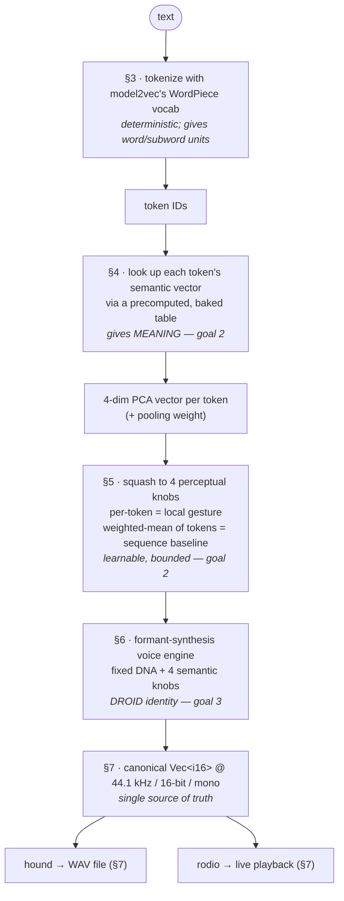

# dootdoot — Design Document

> Status: design complete, pre-implementation. This document is the authoritative
> rationale for every design decision. The normative requirements derived from it
> live in [`spec.md`](./spec.md); the build sequence lives in [`plan.md`](./plan.md).

---

## 1. Overview

**dootdoot** is a command-line application, written in Rust, that **deterministically**
turns text into short bursts of synthesized sound reminiscent of **BB-8**, the
astromech droid from the sequel-trilogy Star Wars films.

It is not a text-to-speech system and not a random "beep generator." It is a
**deterministic, semantically-aware sound language**: the same text always produces
the same audio, and *semantically similar text produces audibly similar sound*. A
user can, over time, learn to associate sonic gestures with meaning — to develop an
intuition for the "language."

### 1.1 Goals

1. **Determinism.** Identical input text yields identical audio output, bit-for-bit,
   forever (subject to an explicit, versioned format contract). The design targets every
   platform; the v1 *guarantee* covers the CI-verified ones, macOS and Linux (§8.1).
2. **Semantic similarity → sonic similarity.** Semantically similar tokens *and*
   semantically similar token sequences sound similar. This is what makes the output
   a learnable language rather than noise.
3. **Droid identity.** The output is unmistakably a droid in the BB-8 family —
   warm, warbly, vocal-but-not-human — regardless of the input text.

### 1.2 Non-goals

- Intelligible speech / TTS. The droid does not pronounce English words.
- Real-time interactive performance / DAW plugin. It is a batch CLI.
- Multi-language excellence. v1 is English-oriented (see §10).
- User-tunable synthesis in v1. The mapping is intentionally fixed (that fixedness
  is what makes the language learnable and shareable).

---

## 2. The core idea and how the decisions hang together

The design is a single pipeline. Each stage was chosen to serve one or more of the
three goals, and later stages depend on earlier ones. The dependency chain:



The determinism guarantee (§8) wraps the whole pipeline; the runtime architecture
(§9) is shaped by the decision to precompute the semantic mapping at build time.

---

## 3. Text → tokens

### 3.1 Decision: map on a per-token basis (not per-character, per-word, or whole-string)

We map sound on the unit of **tokens** produced by a subword tokenizer.

**Why not the alternatives:**
- *Per-character* gives legible length but no semantics and a robotic monotony at the
  character grain.
- *Per-word* is closer but cannot represent sub-word meaning or rare words gracefully.
- *Whole-string hash* throws away all internal structure and makes "longer/related
  text → related sound" impossible.

A subword tokenizer gives us, for free, a desirable cadence property: **frequent
words become a single token (one compact syllable), while rare or long words split
into multiple sub-tokens (a longer, multi-syllable utterance).** This mirrors how
BB-8 speaks in bursts of varying length, and it is the natural unit at which semantic
vectors are available (§4).

### 3.2 Decision: use model2vec's tokenizer (WordPiece), not tiktoken / cl100k_base

During design we first considered `tiktoken` + `cl100k_base` (the GPT-4 encoding),
because it is purpose-built for text→token-IDs, ships a frozen embedded vocab, and is
trivially deterministic. **We rejected it** once goal 2 (semantic similarity) was
made explicit, for a decisive reason:

> **BPE token IDs are not semantic.** In `cl100k_base`, IDs are assigned by merge
> order / frequency. ID 4922 and ID 4923 have no meaning relationship. OpenAI does
> not publish an embedding matrix for `cl100k_base`, so there is no offline way to
> recover semantics from those IDs.

To make "cat" and "dog" sound similar, we need a tokenizer that comes *with* public
semantic vectors. That is `model2vec` (§4), whose vocabulary is a **WordPiece** vocab
(~30k tokens) inherited from its distillation source. Adopting model2vec for
semantics therefore also fixes the tokenizer choice.

**Consequences we accept:**
- WordPiece marks subword continuations (e.g. `play` + `##ing`), which we exploit for
  word-boundary timing (§6.4).
- The base model is (almost certainly) **uncased**, so `Hello` and `hello` tokenize
  — and therefore sound — identically. This is documented behavior, not a bug.

### 3.3 Tokenizer configuration

- **Special tokens disabled** (`add_special_tokens = false`): BERT-family `[CLS]`/
  `[SEP]` carry no meaning for us and would inject phantom syllables.
- **Unknown handling:** WordPiece falls back to `[UNK]` for unrepresentable input.
  `[UNK]` has its own embedding, so it produces a consistent "unknown" warble. We
  keep it — it is deterministic and on-theme ("the droid doesn't know that word").
- The tokenizer is driven by the model's `tokenizer.json`, **embedded in the binary**.

---

## 4. Tokens → semantics (the meaning layer)

### 4.1 Decision: source semantics from model2vec (`potion-base-2M`, int8)

`model2vec` distills a sentence-transformer into a **static embedding lookup table**:
every token maps to a fixed semantic vector, and it pools tokens (weighted mean) to
embed whole sequences. This is an ideal fit:

- **Deterministic** — a frozen lookup table plus linear pooling is a pure function.
- **Semantic at both levels** — token-level *and* sequence-level similarity are
  meaningful (satisfies both halves of goal 2).
- **Offline / embeddable** — a small `safetensors` file; int8-quantizable to a few MB.
- **Rust-native** — `model2vec-rs` exists and is maintained.

**Model choice:** `potion-base-2M`, **int8**. Selected for size (the smallest potion
model) per the constraint that the tool runs comfortably on Mac hardware. `2M` gives
coarser semantics than `8M`/`32M`, but it is sufficient because we further reduce to
4 axes (§5) and only need broad semantic contrasts to be audible. Vectors are ~64-dim.

**Rejected alternatives:** GloVe/word2vec (word-level only, large), fastText (heavier,
older), and running a full transformer at runtime via `candle` (unnecessary weight —
see §9).

### 4.2 Decision: model2vec is a BUILD-TIME dependency only

The function `token → semantic vector → 4 PCA axes` is **frozen** under the format
contract (§8). Therefore it can be **precomputed once, offline, for the entire
~30k-token vocabulary**, and shipped as a tiny lookup table. The runtime never loads
model2vec or a tensor framework.

This works because **PCA projection is linear**. In exact arithmetic, sequence pooling
on the baked 4-dim vectors equals pooling the original 64-dim vectors and then
projecting:

```
project(mean_w(token_vectors)) == mean_w(project(token_vectors))
```

(`mean_w` = the SIF/weighted mean; weights are baked per token.) This identity is exact
**before quantization**. We store the projected vectors as int16, which introduces a
small, bounded rounding error, so the precise runtime guarantee is: *the runtime pools
the frozen quantized approximation, deterministically.* The quantization is part of the
`FORMAT_V1` contract (§8.2), so the approximation is identical on every run and on every
verified platform (§8.1).

**Quantization scheme (deterministic, lossy by a bounded amount).** Each of the 4 axes
has a fixed dequantization scale `s_k` chosen at build time so the vocab's projected
values span the int16 range; a stored value `q` dequantizes to `q · s_k` (f64). The
per-axis max error is `s_k / 2`. Pooling weights are quantized the same way with their
own scale `s_w`. All five scales live in the file header. The nonlinear "squash" (§5.3)
is **never baked**; it is applied at runtime after pooling (for the baseline) and after
per-token lookup (for gestures), so it operates on the dequantized values and the
linearity argument holds up to int16 rounding.

**Baked file (`format_v1.bin`) layout and size.** Little-endian throughout.
- *Header* (a few hundred bytes): magic + format version; vocab size; axis count (4);
  the 4 axis dequant scales + the weight dequant scale (f32 each); the per-axis squash
  statistics (§5.3); and the model-, tokenizer- and PCA-matrix hashes (§8.2).
- *Per-token record* (10 bytes): 4 × int16 (quantized PCA components) + 1 × int16
  (quantized pooling weight).
- *Total* ≈ 30k × 10 bytes + header ≈ **~300 KB** (int8-quantized model embeddings are a
  build-time input only and are not shipped).

Note the runtime file stores the **projected** values, so it does **not** carry the
64→4 PCA matrix; that matrix is a build-time artifact, recorded in the contract only by
hash for provenance.

See §9 for the resulting runtime/build-time split.

---

## 5. Semantics → perceptual axes (the learnable layer)

### 5.1 Decision: reduce ~64 dims to exactly 4 axes via pinned PCA

64 dimensions are neither audible nor learnable. We collapse them to a **small, stable,
perceptually meaningful** set.

**Mechanism: pinned PCA.** Offline, we run the entire vocab through PCA, keep the top
**K = 4** principal components, and **bake the fixed projection matrix** into the
format artifact. At runtime each token/sequence vector projects onto these 4 axes.

**Why PCA over alternatives:**
- *Random projection* is deterministic but produces arbitrary axis mixtures with no
  salience ordering — much harder to learn by ear.
- *Hand-picked semantic anchors* (`hot−cold`, `big−small`) are maximally interpretable
  but subjective and labor-intensive. We may *optionally* use anchor words later to
  *label* the discovered PCA axes for documentation, but PCA does the heavy lifting.

PCA's key virtue for goal 2: it **orders axes by how much real semantic variation they
carry**, so axis 1 is the single most salient meaning-direction — the first thing a
listener's ear learns.

**Why K = 4:** 1–2 axes collapse too many words together; 6+ axes overwhelm a listener.
3–4 is the sweet spot; 4 gives enough expressive knobs for a believable droid voice.

### 5.2 Decision: which axis drives which perceptual knob

Axes map to knobs in **variance order**, so the most salient knob carries the most
salient semantic split:

| Axis  | Knob                     | Range / meaning                              |
|-------|--------------------------|----------------------------------------------|
| PCA-1 | **Pitch center**         | low ↔ high (most perceptually obvious)       |
| PCA-2 | **Vowel/formant position** | `ee ↔ ah ↔ oo` (meanings "say" vowels)     |
| PCA-3 | **Contour / glide shape** | falling-swoop ↔ rising-swoop                |
| PCA-4 | **Warble depth**          | steady ↔ heavy burble                       |

PCA-2 maps to **vowel position** rather than generic brightness/lowpass deliberately:
it is both more authentically BB-8 (the real voice was a vowel-formant synth, §6.1)
and more learnable (the ear maps meaning to vowel color).

### 5.3 Decision: bounded squash applied post-pooling

PCA outputs are unbounded. Each axis is squashed into a fixed perceptual range using
**frozen per-axis statistics** computed offline over the vocab (e.g. percentiles or
mean/std).

**The squash function is chosen at artifact-generation time, not at the end of tuning.**
The function (tanh vs percentile-clamp) determines which statistics the header must
carry, so it cannot be deferred past the point where `format_v1.bin` is produced. The
build pipeline reflects this: the squash function is selected when squash stats are
computed (plan task T-15), and any later adjustment during voice tuning (T-46)
**regenerates the artifact** before the `FORMAT_V1` freeze (T-48). Because the squash is
applied at runtime and is *not* baked into the per-token vectors, a change touches only
the header statistics, so regeneration is cheap. Whatever is frozen becomes part of
`FORMAT_V1` (§8.2).

Squash is applied in two places, consistently, on the dequantized values:
- **Per token** → the token's local gesture knob values.
- **On the weighted-mean of the sequence's token vectors** → the utterance baseline.

### 5.4 Decision: two-level application (sequence baseline + per-token modulation)

- The **pooled sequence vector** sets the *baseline/center* of each of the 4 knobs for
  the whole utterance — the phrase's overall "mood." This is what makes *semantically
  similar sequences* sound similar (goal 2, sequence half).
- Each **token's vector** modulates *around* that baseline — the local gesture. This is
  what makes *semantically similar tokens* sound similar (goal 2, token half).

---

## 6. Perceptual axes → sound (the droid voice)

### 6.1 What actually makes BB-8 sound like BB-8 (research basis)

BB-8's voice (Star Wars: The Force Awakens) was created by J.J. Abrams playing the
**Bebot "Robot Synth"** iPad app — an X/Y touch synth whose signature is **vocal
formant filtering** with **expressive pitch slides** (dragging across the pad) — and
running its output through a **hardware talkbox** operated by Bill Hader, which
imposed a *second* layer of human vowel/consonant formants. Takes that "sounded too
human" were rejected.

The defining acoustic ingredients, in priority order:

1. **Formants / vowel resonances** — the dominant identity. Moving formant peaks make
   the sound articulate vowel-like shapes (`ee→ah→oo`), so it reads as "talking"
   without being intelligible. Present *twice* in the original (Bebot's vocal filter +
   the talkbox).
2. **Continuous pitch glides (portamento)** — BB-8 *swoops* between pitches rather than
   stepping. This is the emotional, singing quality.
3. **High-ish, deliberately non-human pitch register** — cute and bright, kept out of
   the human speech band.
4. **Warble / vibrato** from the live performance.
5. A faint **electronic edge** so it never sounds fully organic.

**This rules out FM or ring-mod as the *core*.** They were considered, but the core
must be **formant synthesis**; ring-mod survives only as a faint seasoning.

> Sources: Time, SlashFilm, GamesRadar coverage of the BB-8 voice; Loopy Pro forum
> identifying the app as Bebot; Bebot "Robot Synth" by Normalware (App Store).

### 6.2 Decision: synthesis method = formant-core with portamento

The fixed voice chain per token gesture (the **droid DNA**):

1. **Harmonically-rich source** — band-limited sawtooth/pulse (formants need harmonics
   to sculpt).
2. **Formant filter bank** — 2–3 resonant bandpass filters at vowel frequencies. This
   *is* the talkbox/Bebot identity. Vowel position is steered by PCA-2.
3. **Portamento** — pitch **glides** smoothly between consecutive token gestures rather
   than jumping (the BB-8 swoop). Glide time is fixed.
4. **Warble LFO** on pitch — fixed *rate*; *depth* steered by PCA-4.
5. **Faint ring-mod** at a fixed frequency, low mix — the electronic edge.
6. **Amplitude envelope** — fixed snappy attack/decay per syllable; pitch register
   biased high.

### 6.3 Decision: the fixed/variable split (guarantees droid identity)

- **Fixed (the DNA, identical for all input):** formant *character* (the filter
  structure and vowel locus), portamento glide time, warble *rate*, ring-mod frequency
  and mix, envelope shape, high-register bias, source waveform.
- **Variable (the 4 semantic axes only):** pitch center, vowel position, contour/glide
  shape, warble depth.

Because only 4 tasteful, bounded knobs move and everything else is constant, **every**
output is unmistakably the same droid (goal 3), while the knobs carry meaning (goal 2).

### 6.4 Decision: temporal / rhythmic structure

- **One token = one syllable** — a single continuous formant-glide warble (not a
  cluster of discrete beeps). Base duration **fixed** (~150 ms). Duration is *not* a
  fifth semantic axis — keeping it fixed preserves the 4-axis learnable contract and a
  regular, learnable rhythm.
- **Within a word, syllables glide together** — consecutive subword tokens of the same
  word (detected via WordPiece `##` continuation marking) are connected by portamento
  with **no silence**, so a multi-token word sounds like one flowing multi-syllable
  utterance (`playing` = two glided syllables). Word length becomes audible.
- **Between words, a short pause** (~80 ms) — the burst-like BB-8 cadence; lets the ear
  segment words.
- **Punctuation is control-only, not voiced.** A fixed set of prosodic punctuation
  tokens (`.` `!` `?` `,` `;` `:`) is recognized and treated as control markers: they do
  **not** produce their own syllable. Instead each shapes the **preceding** syllable's
  final glide and inserts a pause: `?` → rising final glide + longer pause; `.`/`!` →
  falling final glide + longer pause; `,`/`;`/`:` → medium pause, no contour change. They
  therefore do not add to the voiced-syllable count. Any other symbol that is *not* in
  this prosodic set is voiced as a normal token (it has its own embedding and gesture).
  In `--explain`, prosodic punctuation appears as a distinct control row (e.g.
  `. → falling glide + pause`), separate from the per-token knob rows.
- **Utterance bounds** — short leading/trailing silence padding so files top-and-tail
  cleanly.

Net effect: short words = quick single warbles; long words = flowing multi-syllable
warbles; sentences = phrased bursts with intonation — recognizable "droid speech,"
with the semantic *timbre* (pitch/vowel/swoop/warble) as the learnable content.

---

## 7. Sound → output

### 7.1 Decision: the engine produces one canonical buffer; file and playback are sinks

The synthesis engine always produces a single in-memory **`Vec<i16>` @ 44.1 kHz, mono**.
This buffer is the **single source of truth**. WAV writing and live playback are two
thin sinks that consume the identical buffer, guaranteeing *what you hear == what you'd
save*, bit-for-bit. Tests assert only on this buffer / its WAV serialization; the audio
device is never in the test path.

To keep `dootdoot-core` I/O-free (§9.2), the core's WAV support **serializes the buffer
to an in-memory byte vector (or any `impl std::io::Write`)**; it never touches the
filesystem. The `dootdoot` binary owns the actual file write (and the playback device).

### 7.2 Decision: audio format = 44.1 kHz / 16-bit signed PCM / mono

- **44,100 Hz** — universally playable; comfortably above what the formant peaks +
  warble + glides need (no aliasing). 22,050 was rejected (risks harshness on bright
  formants).
- **16-bit signed PCM** — ample range for a synth voice; canonical WAV; deterministic
  via one fixed float→i16 rounding rule (no dithering).
- **Mono** — it is a single droid voice; mono is honest, halves file size, and avoids
  any pan/width nondeterminism. (Subtle stereo width could be added later as a pure
  post-effect without touching the mapping.)

### 7.3 Decision: `hound` for WAV, `rodio` for playback

- **`hound`** — simple, deterministic, well-maintained WAV writer.
- **`rodio`** (on `cpal` → CoreAudio on Mac) — consumes the same i16 buffer for live
  playback. Playback is a sink only and never asserted in tests.

### 7.4 Decision: CLI surface

Built with `clap` (derive).

**Input:**
- Positional `TEXT`: `dootdoot "hello there"`.
- **Stdin fallback** when `TEXT` is absent and stdin is piped: `echo "hi" | dootdoot`.
- No arg + interactive TTY → print help and **exit non-zero** (consistent with FR-3;
  distinct from empty/whitespace *input*, which emits the "?" chirp and exits 0).

**Output behavior:**
- No `-o` → **play live** (default).
- `-o, --output <FILE>` → **write WAV, no playback** (scripting-friendly default).
- `-o … --play` → **write and play**.

**Learnability feature:**
- `--explain` → per-token table to **stderr**: `token │ pitch │ vowel │ contour │ warble`
  (so users *see* the 4 axes and build intuition). On stderr so it never pollutes piped
  audio.

**Empty / whitespace-only input:** always emit a **fixed inquisitive "?" chirp**
(a rising-glide warble, the droid going "hm?"), exit 0. The chirp is a fixed gesture,
not derived from the (absent) text, so it stays deterministic. *(Chosen over erroring
or silence for being playful and on-theme.)*

**Standard:** `--version` (surfaces the `FORMAT_V1` identifier), `--help`; tasteful exit
codes (0 ok, non-zero on error such as absurd-length input).

**Deliberately omitted in v1:** `--seed` (meaningless — determinism comes from text +
frozen model), and synthesis-tuning knobs (`--gain`, `--speed`). The fixed mapping is
the point. A global `--gain`/`--speed` could be added later as pure post-processing
that does not touch the semantic mapping.

---

## 8. Determinism contract

### 8.1 Decision: bit-exact determinism, verified on macOS + Linux

Determinism is the headline property, so we make it **provably portable**. The design is
engineered to be bit-exact on any platform, but the **v1 guarantee covers the platforms
we actually verify in CI: macOS and Linux.** Windows is intended to match and the math is
written to make that true, but it is **not a guaranteed platform until it is in the
golden-hash CI matrix** (a planned addition, not a v1 promise). We claim only what we
test.

The only real threat is **floating-point transcendentals**. IEEE-754 `+ − × ÷` are
bit-reproducible across platforms (Rust does not auto-contract to FMA), but libm's
`sin`/`exp`/`tanh` can differ by an ULP between platforms. Therefore:

- We **own all transcendental math** in the audio path — pinned polynomial/table
  implementations of `sin`/`exp`/`tanh` (and any other needed), never libm.
- All synthesis is done in **`f64`**.
- A single fixed **float→i16 rounding rule**; no dithering.
- No fast-math / FMA contraction in the audio path.

This makes one set of **golden WAV fixtures** authoritative across the verified OSes and
turns "deterministic" into a demonstrable claim. Adding Windows is a matter of extending
the CI matrix and committing identical hashes; until then, the guarantee is scoped to
macOS + Linux.

### 8.2 Decision: the versioned FORMAT contract

Everything that can affect a single output sample is bundled under one identifier,
**`FORMAT_V1`**. If a change can move one sample, it is in this list — and changing it
requires a version bump (below). **`FORMAT_V1` includes:**

*Mapping inputs*
- model2vec model hash (the build-time embedding source);
- the full tokenizer configuration, by hash of the embedded `tokenizer.json` **plus** the
  runtime flags that affect tokenization (`add_special_tokens = false`, lowercasing /
  normalization, the `##` continuation convention) — not just the vocab;
- the pinned 64→4 PCA projection matrix (by hash);
- the int16 **quantization scales** for the 4 axes and the pooling weight, and the
  dequantization rule (§4.2);
- the per-axis **squash statistics and the squash function** (§5.3);
- the pooling rule (SIF/weighted-mean definition).

*Synthesis*
- all fixed synthesis constants (formant frequencies/vowel locus, axis→knob ranges,
  glide/portamento time, warble rate, ring-mod frequency and mix, envelope shape,
  register bias, source waveform);
- timing constants (syllable duration, inter-word pause, leading/trailing padding);
- the **prosodic-punctuation rules** (which symbols are control-only, their glide/pause
  effects, §6.4);
- the **empty-input "?" chirp** gesture constants (§7.4);
- the owned-math implementation version (§8.1).

*Serialization*
- the single **float→i16 rounding rule** (no dithering);
- the **WAV serialization choices** (44.1 kHz, 16-bit signed PCM, mono, and the exact
  header bytes) — these define the file the golden hashes are taken over.

`FORMAT_V1` is surfaced by `--version`. **Any change that alters a single output sample
bumps it to `V2`.** This gives users the guarantee: *same text + same FORMAT version =
same sound, forever, on every verified platform (§8.1)*, while letting the voice evolve
deliberately.

---

## 9. Architecture

### 9.1 Decision: precompute the mapping → minimal runtime

Because the token→4-axis mapping is frozen (§4.2), the heavy ML machinery is confined
to build time. The resulting split:

**Runtime dependencies (shipped binary):**
- `tokenizers` (HuggingFace) — tokenize text → IDs using the embedded `tokenizer.json`.
- the baked **~300 KB** `format_v1.bin` table (header + per-token 4×int16 + int16
  weight; layout and size in §4.2), embedded.
- the **owned math** module.
- `hound`, `rodio`, `clap`.
- **No `model2vec-rs`, no `candle`, no tensor framework.** Smaller, faster-starting,
  cleaner to build on Apple Silicon.

**Build-time only (`xtask`, never shipped):**
- `model2vec-rs` (loads `potion-base-2M`), `nalgebra`/`linfa` (PCA/SVD).

### 9.2 Decision: workspace layout (lib + bin + xtask)

- **`dootdoot-core`** (library): the pure, deterministic engine — tokenizer wrapper,
  mapping (baked-table load + linear pooling + axis squash), synth (source → formant
  bank → portamento → warble → ring-mod → envelope), the **owned math** module, WAV
  serialization **to bytes / an `impl Write`**, and the `FORMAT_V1` constants. No
  filesystem or audio-device I/O (it hands back buffers/bytes; the binary performs the
  actual writes). Fully unit-testable and reusable.
- **`dootdoot`** (binary): thin CLI shell — `clap` parsing, stdin handling, `rodio`
  playback, `--explain` printing, error/exit-code mapping. Calls into core.
- **`xtask`** (build-time tool, not shipped): the offline generator — loads
  `potion-base-2M` via `model2vec-rs`, extracts all 64-dim embeddings, computes PCA→4,
  **canonicalizes component signs** (e.g. force each component's largest-magnitude
  loading positive, so the result is reproducible), computes squash stats, and writes
  the committed `assets/format_v1.bin`.

### 9.3 Decision: committed, reviewable artifacts

`assets/format_v1.bin` and `assets/tokenizer.json` are **committed to the repo and
embedded** in the binary (`include_bytes!`). The frozen contract literally lives in a
reviewable artifact.

Two distinct build paths, with different network stories:
- **Normal build** (`cargo build`/`test`/`install`): compiles from the committed assets
  and is **fully offline** — no network, ever. This is the guarantee in NFR-8.
- **Asset regeneration** (running `xtask` to rebuild `format_v1.bin`): a rare, deliberate
  operation that needs the `potion-base-2M` model as input. Whether that model is a
  **vendored blob** (regeneration also offline) or **downloaded once** (regeneration may
  require network) is the open ops decision in §11 and plan task T-11. Regeneration is
  **not** covered by the offline guarantee until T-11 settles it.

---

## 10. Input handling & edge cases

| Case | Behavior |
|------|----------|
| Empty / whitespace-only | Always emit the fixed **"?" chirp**, exit 0 (§7.4). |
| Special tokens (`[CLS]`/`[SEP]`) | **Disabled** (`add_special_tokens = false`). |
| Unknown tokens (`[UNK]`) | **Kept and voiced** — a consistent "unknown" warble. |
| Case | Whatever the (uncased) tokenizer does — `Hello` == `hello`. Documented. |
| Numbers | Natural WordPiece subwording; voiced as normal tokens. |
| Punctuation | Prosodic punctuation (`.!?,;:`) is **control-only** — shapes the prior syllable's glide + pause, not voiced, not counted as a syllable (§6.4). Other symbols are voiced normally. |
| Non-Latin scripts / emoji | Largely `[UNK]`/per-char with an English vocab → repetitive. **Acceptable for v1; documented as English-oriented.** |
| Very long input | **Warn** on stderr past ~2,000 tokens (≈8 min audio); **hard error** at a generous cap (~100k tokens) to prevent runaway files. Both bounds fixed and documented. |

The throughline: lean on the tokenizer's natural behavior, keep everything
deterministic, and only error on genuinely empty (handled as a chirp) or absurd input.

---

## 11. Deliberately deferred (tuning / ops, not design forks)

These do not change the architecture and are settled during implementation:

- **Exact constant values** — formant frequencies and vowel locus, pitch/vowel ranges,
  glide time, warble rate, envelope shape, ring-mod frequency/mix, syllable duration,
  pause lengths, register bias. Tuned **by ear**, then frozen into `FORMAT_V1`.
- **Squash function** — tanh vs percentile-clamp. Note this is *not* fully open-ended:
  it must be chosen when `format_v1.bin` is generated (T-15), and any later change
  regenerates the artifact before the freeze (§5.3, T-46).
- **How `xtask` obtains `potion-base-2M`** — vendored blob (regeneration stays offline)
  vs scripted download (regeneration may need network). This affects only regeneration,
  never the normal offline build (§9.3, T-11).
- **Packaging** — `cargo install`, Homebrew, prebuilt release binaries.
- **License.**

---

## 12. How the design satisfies the goals (traceability)

- **Determinism (goal 1):** frozen `FORMAT_V1` (§8.2) + bit-exact owned math (§8.1) +
  buffer-as-source-of-truth (§7.1) + committed artifacts (§9.3).
- **Semantic similarity → sonic similarity (goal 2):** model2vec semantics (§4) +
  linear PCA reduction with sequence pooling that is exact up to int16 quantization
  (§4.2, §5) + two-level baseline/modulation (§5.4).
- **Droid identity (goal 3):** research-grounded fixed formant voice with portamento
  (§6.1–6.3) + fixed/variable split that constrains all input to a tasteful droid
  parameter space.
