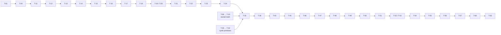
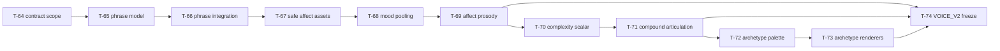
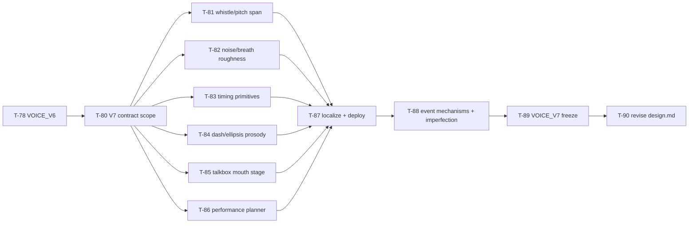
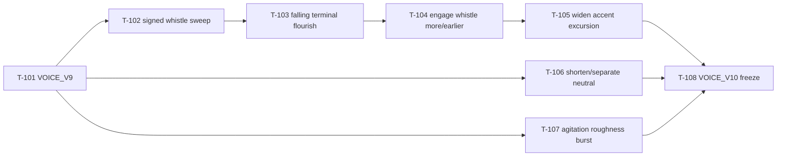
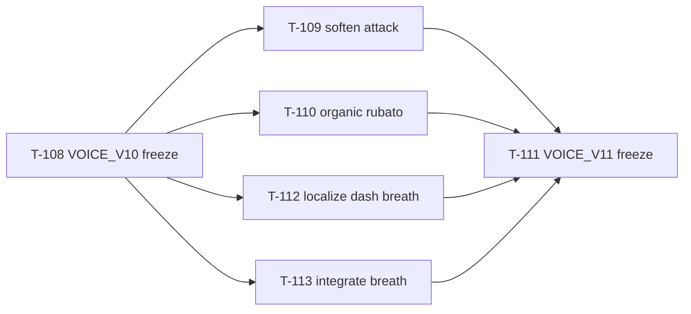
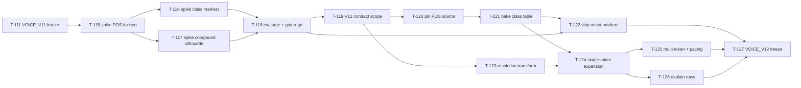

# dootdoot — Implementation Plan

> Derived from [`spec.md`](./spec.md) and [`design.md`](./design.md). Tasks are sized
> to **a few hours or less**. Each has a stable unique ID (**T-NN**), dependencies,
> related requirements, and an estimate. Phases are roughly sequential; within a phase,
> tasks may often run in parallel unless a dependency says otherwise.
>
> Legend: **Deps** = task IDs that must finish first. **Reqs** = requirement IDs
> covered. **Est** = rough effort.

> **Execution method — red-green TDD (mandatory for every task).** Each task below is
> implemented test-first: write a failing test that pins the behavior (**red**, confirm
> it fails for the right reason), write the minimum code to pass it (**green**), then
> **refactor** with the suite green. Task estimates already include writing the tests;
> "done" means the behavior is covered by a passing test at the appropriate level (value
> test, `proptest` invariant, `insta` snapshot, or golden-WAV hash — see
> [`style.md`](./style.md) §9). Where a task's deliverable _is_ a test harness or fixture
> (e.g. T-09/T-10, T-25, T-55–T-60), that test is the red step for the code it guards.
> Aim for roughly one red-green cycle per `jj` revision.

> **Progress tracking.** Every task is a checkbox. Check it off (`- [ ]` → `- [x]`) only
> when the task is genuinely done: its behavior is covered by a passing test (per the TDD
> rule above), it satisfies the listed **Reqs**, and it has landed in its own `jj`
> revision. Update the box in the same revision that completes the task, so this file
> stays the single source of truth for what's built. Don't check a box for partial or
> untested work.

---

## Phase 0 — Workspace & scaffolding

- [x] **T-01 — Initialize Cargo workspace.** Create the workspace `Cargo.toml` with members
      `dootdoot-core`, `dootdoot`, `xtask`. Set edition, shared lints, release profile
      (no fast-math, no FMA-contraction flags).
      Deps: — · Reqs: NFR-9 · Est: 1h
- [x] **T-02 — Scaffold `dootdoot-core` crate.** Library crate with empty module tree:
      `tokenizer`, `mapping`, `synth`, `mathx` (owned math), `wav`, `format`. Public API
      stubs. No deps yet.
      Deps: T-01 · Reqs: NFR-9, NFR-10 · Est: 1h
- [x] **T-03 — Scaffold `dootdoot` binary crate.** Binary depending on `dootdoot-core`;
      `main` stub.
      Deps: T-01 · Reqs: NFR-9 · Est: 0.5h
- [x] **T-04 — Scaffold `xtask` crate.** Build-time-only binary; add `model2vec-rs`,
      `nalgebra`/`linfa`, serialization deps here only.
      Deps: T-01 · Reqs: FR-40, NFR-6 · Est: 1h
- [x] **T-05 — CI skeleton.** GitHub Actions: build + test on macOS and Linux; cache cargo.
      Deps: T-01 · Reqs: NFR-17 · Est: 1.5h

---

## Phase 1 — Owned math (`mathx`) — needed early; everything downstream depends on it

- [x] **T-06 — Design `mathx` API + value tables.** Decide table sizes/polynomial degrees
      for `sin`, `exp`, `tanh`; document the determinism rationale.
      Deps: T-02 · Reqs: NFR-3 · Est: 1.5h
- [x] **T-07 — Implement `mathx::sin`/`cos`.** Range-reduction + polynomial/table, `f64`.
      Deps: T-06 · Reqs: NFR-3, NFR-5 · Est: 2.5h
- [x] **T-08 — Implement `mathx::exp` and `mathx::tanh`.** (tanh via exp.)
      Deps: T-06 · Reqs: NFR-3 · Est: 2.5h
- [x] **T-09 — `mathx` accuracy tests.** Compare to `std` within tolerance across the
      domain; assert no NaNs/inf at boundaries.
      Deps: T-07, T-08 · Reqs: NFR-19 · Est: 2h
- [x] **T-10 — `mathx` pinned-output tests.** Assert exact bit outputs at fixed sample
      points (regression guard / cross-platform anchor).
      Deps: T-07, T-08 · Reqs: NFR-2, NFR-19 · Est: 1.5h

---

## Phase 2 — Build-time asset generation (`xtask`)

- [x] **T-11 — Acquire `potion-base-8M` (upstream F32) + pin a source manifest.** Decide
      vendored-blob vs scripted download; place model + `tokenizer.json` under a
      build cache). Commit `assets/source_manifest.toml` pinning HF repo, exact commit SHA,
      `model.safetensors`/`tokenizer.json` SHA-256, `hidden_dim=256`, `normalize=true`, dtype;
      have `xtask` validate the acquired files against it (and abort on mismatch) before doing
      any work. Document the choice. (dtype is build-time only; xtask emits its own int16
      records inside the `.doot` asset.)
      Deps: T-04 · Reqs: FR-5, FR-42, FR-43, NFR-8 · Est: 1.5h
- [x] **T-12 — Load model & extract all token embeddings.** Use `model2vec-rs` to read the
      ~30k × ~256 embedding matrix and per-token weights.
      Deps: T-11 · Reqs: FR-40 · Est: 2h
- [x] **T-13 — Compute top-4 PCA projection.** Center, SVD/PCA via `nalgebra`/`linfa`, keep
      4 components.
      Deps: T-12 · Reqs: FR-40 · Est: 2.5h
- [x] **T-14 — Canonicalize component signs.** Deterministic rule (largest-magnitude
      loading positive); unit-test reproducibility.
      Deps: T-13 · Reqs: FR-41 · Est: 1h
- [x] **T-15 — Choose squash function + compute per-axis stats.** Select the squash
      (tanh vs percentile-clamp) **here** — it determines which stats the `.doot` asset carries —
      and derive the per-axis stats over the full vocab. Document the choice; T-52 may revise
      it and regenerate the asset before the freeze.
      Deps: T-14 · Reqs: FR-12 · Est: 1.5h
- [x] **T-16 — Define the dootdoot asset spec.** Protocol Buffers payload with asset spec
      version, vocab size, axis count, the 4 axis dequant scales + weight dequant scale as
      f32, squash stats, model/tokenizer/PCA-matrix hashes, tokenizer JSON, and compact
      per-token records (4×int16 quantized PCA + 1×int16 quantized weight = 10 bytes). The
      runtime asset stores projected values, so it does NOT contain the PCA matrix. Document the
      layout.
      Deps: T-15 · Reqs: FR-10, FR-38 · Est: 1.5h
- [x] **T-17 — Serialize per-token 4-vectors + weights to `dootdoot_asset_v1.doot`.** Project each
      token; quantize components and weight to int16 with the **symmetric signed, zero-point-
      free** rule (`s = max|·|/32767`, round-half-to-even, clamp to ±32767, code −32768
      unused; design.md §4.2); write the protobuf asset; compute and embed
      model/tokenizer/PCA hashes plus tokenizer JSON. Unit-test the quantize↔dequantize round-trip
      and tie-rounding determinism.
      Deps: T-16 · Reqs: FR-9, FR-10, FR-40, FR-42 · Est: 2h
- [x] **T-18 — Commit `assets/dootdoot_asset_v1.doot`.** Verify size (~1 MB), parser
      compatibility, and add a regeneration README note.
      Deps: T-17 · Reqs: FR-42, NFR-7 · Est: 0.5h

---

## Phase 3 — Core asset, mapping, and tokenizer layers

- [x] **T-19 — Asset module: load embedded `.doot` asset.** `include_bytes!` the protobuf
      asset; parse the dootdoot asset spec; expose tokenizer JSON, PCA stats, squash stats,
      hashes, asset spec ids, and voice contract ids.
      Deps: T-02, T-18 · Reqs: FR-9, FR-33, FR-38 · Est: 2h
- [x] **T-20 — `tokenizer` wrapper.** Wrap HF `tokenizers` with tokenizer JSON from the
      embedded `.doot` asset;
      `add_special_tokens=false`; expose token IDs + `##` continuation flags. Apply the
      control-token drop filter (`[PAD]`/`[CLS]`/`[SEP]`/`[MASK]` by ID, **keeping** `[UNK]`)
      so literal `"[MASK]"` etc. are dropped; test literal `"[CLS]"`/`"[MASK]"` and that
      filtered-to-empty routes to the chirp (design.md §3.3).
      Deps: T-02, T-18 · Reqs: FR-5, FR-6, FR-8 · Est: 2h
- [x] **T-21 — Token → 4-vector lookup.** Map IDs to baked vectors + weights; handle
      `[UNK]` via its own entry.
      Deps: T-19, T-20 · Reqs: FR-7, FR-9 · Est: 1h
- [x] **T-22 — Sequence pooling.** Token-weight-scaled mean of per-token 4-vectors →
      baseline vector: `(1/n) · Σ(wᵢ·vᵢ)`, denominator = token count `n`, **no L2 norm**
      (dootdoot-specific, not `model2vec.encode()`; design.md §4.2).
      Deps: T-21 · Reqs: FR-11 · Est: 1h
- [x] **T-23 — Axis squash.** Implement chosen squash using frozen stats + `mathx`; apply
      per-token and to baseline.
      Deps: T-22, T-08 · Reqs: FR-12 · Est: 1.5h
- [x] **T-24 — Knob assembly.** Per axis `k`: `knob = clamp(B_k + α_k·(T_{k}−B_k),
lo_k, hi_k)` where `B_k`/`T_k` are the squashed baseline/per-token knobs and `α_k` is the
      frozen modulation depth (design.md §5.4). Produce the per-syllable knob set {pitch, vowel,
      contour, warble} in fixed axis order; test single-token (`knob==B_k`) and clamp at bounds.
      Deps: T-23 · Reqs: FR-13, FR-14, FR-18 · Est: 1.5h
- [x] **T-25 — Semantic-sanity tests.** Assert `cat↔dog` < `cat↔airplane` (token) and
      analogous sequence-level ordering.
      Deps: T-24 · Reqs: NFR-14, NFR-15 · Est: 1.5h

---

## Phase 4 — Synthesis engine (`synth`)

- [x] **T-26 — Define fixed synthesis constants.** Initial values for formant freqs/vowel
      locus, glide time, warble rate, ring-mod freq/mix, envelope, register bias,
      durations, pauses. (Refined in Phase 7.)
      Deps: T-02 · Reqs: FR-17, FR-22, FR-24 · Est: 1.5h
- [x] **T-27 — Harmonically-rich source oscillator.** Band-limited saw/pulse via `mathx`.
      Deps: T-07, T-26 · Reqs: FR-16 · Est: 2h
- [x] **T-28 — Formant filter bank.** 2–3 resonant bandpasses; vowel position parameter
      steers center frequencies.
      Deps: T-27 · Reqs: FR-16, FR-18 · Est: 2.5h
- [x] **T-29 — Pitch model: register bias + portamento + contour.** Smooth glide between
      syllables; contour shape applied per gesture.
      Deps: T-27 · Reqs: FR-16, FR-18, FR-19 · Est: 2.5h
- [x] **T-30 — Warble LFO.** Fixed-rate vibrato on pitch; depth from warble knob.
      Deps: T-29, T-07 · Reqs: FR-16, FR-18 · Est: 1h
- [x] **T-31 — Ring-mod + amplitude envelope.** Faint fixed ring-mod; snappy fixed AD
      envelope per syllable.
      Deps: T-27, T-07 · Reqs: FR-16, FR-17 · Est: 1.5h
- [x] **T-32 — Single-syllable renderer.** Compose the signal graph into one syllable
      buffer (`f64`): pitch model (center+portamento+warble) drives the oscillator/source →
      formant bank → ring-mod → amplitude envelope (design.md §6.2).
      Deps: T-28, T-29, T-30, T-31 · Reqs: FR-15, FR-16 · Est: 2h
- [x] **T-33 — Utterance sequencer.** Lay out syllables with intra-word glides, inter-word
      pauses, punctuation intonation, leading/trailing padding. Punctuation attaches
      **backward only**: leading/standalone markers are dropped (no forward attach); only the
      first of consecutive markers shapes the prior glide; input with zero voiced syllables
      after filtering routes to the "?" chirp (design.md §6.4).
      Deps: T-32, T-24 · Reqs: FR-21, FR-22, FR-23, FR-24 · Est: 2.5h
- [x] **T-34 — Fixed "?" chirp gesture.** Hardcoded inquisitive rising-glide for empty
      input.
      Deps: T-32 · Reqs: FR-4 · Est: 1h

---

## Phase 5 — Output buffer & WAV (`wav`)

- [x] **T-35 — Float→i16 quantization.** Single fixed rounding rule (no dither); clamp.
      Deps: T-02 · Reqs: FR-25, FR-29, NFR-4 · Est: 1h
- [x] **T-36 — Canonical buffer assembly.** Produce one `Vec<i16>` @ 44.1k mono as the
      sole source of truth.
      Deps: T-33, T-35 · Reqs: FR-25, FR-30 · Est: 1h
- [x] **T-37 — WAV writer via `hound`.** Serialize the canonical buffer to 44.1k/16-bit/
      mono WAV.
      Deps: T-36 · Reqs: FR-26, FR-29 · Est: 1h

---

## Phase 6 — CLI binary (`dootdoot`)

- [x] **T-38 — `clap` argument model.** Positional `TEXT`, `-o/--output`, `--play`,
      `--explain`, `--version` (shows `VOICE_V1`), `--help`.
      Deps: T-03 · Reqs: FR-1, FR-31, FR-33, FR-34 · Est: 1.5h
- [x] **T-39 — Input resolution.** Arg vs piped stdin vs interactive TTY; empty/whitespace
      → chirp path.
      Deps: T-38, T-34 · Reqs: FR-2, FR-3, FR-4 · Est: 1.5h
- [x] **T-40 — Output routing.** Implement no-`-o`→play, `-o`→write, `-o --play`→both.
      Deps: T-38, T-36, T-37 · Reqs: FR-26, FR-27, FR-28 · Est: 1h
- [x] **T-41 — Live playback via `rodio`.** Stream the canonical buffer; CoreAudio on Mac.
      Sub-second time-to-first-sound is an architectural guarantee of the no-tensor-runtime
      design (embedded table, no model load), not a tuned hot path.
      Deps: T-36 · Reqs: FR-27, FR-30, NFR-12, NFR-13 · Est: 1.5h
- [x] **T-42 — `--explain` table.** Per-token `token │ pitch │ vowel │ contour │ warble`
      to stderr, with prosodic punctuation shown as distinct control rows.
      Deps: T-24, T-38 · Reqs: FR-31, FR-32, FR-23a · Est: 1.5h
- [x] **T-43 — Input limits.** Warn past ≈8 min/≈40 MB (≈2,000 tokens); hard error before
      synthesis past the ≈30 min/≈160 MB ceiling (≈8,000 tokens), no audio. Byte/duration is
      the normative bound; token count is a derived pre-check (design.md §10).
      Deps: T-39, T-20 · Reqs: FR-36, FR-37 · Est: 1h
- [x] **T-44 — Exit codes & error messages.** Friendly stderr errors; correct exit codes.
      Deps: T-39, T-40 · Reqs: FR-35 · Est: 1h

---

## Phase 7 — Voice tuning (freeze the sound)

> **Tuning decomposition.** T-45…T-50 were inserted after
> [`bb8-sound-signature-analysis.md`](./research/bb8-sound-signature-analysis.md) to split the
> original broad T-45 tuning pass into implementation-sized, testable voice-DNA changes
> while keeping completed task IDs stable. Metrics are directional aids only; by-ear review
> remains the final acceptance gate for T-51.

- [x] **T-45 — Establish BB-8 comparison corpus + metrics harness.** Keep a small local
      reference/dootdoot comparison workflow for Phase 7 tuning: decode the downloaded BB-8 clips to
      mono 44.1 kHz, render a fixed dootdoot phrase corpus, and report the directional metrics
      from the analysis doc (active fraction/islands, magnitude-spectrum centroid/85% rolloff,
      dominant-peak motion, harmonicity, and broad power bands). Document that the active-island
      metrics are gate-dependent and that BB-8 brightness mainly lives in the 2–5 kHz upper-mid
      region, not >6 kHz. This is a tuning aid, not a golden contract.
      Deps: T-40, T-41 · Reqs: NFR-16 · Est: 1.5h
- [x] **T-46 — Add internal pitch and vowel trajectories.** Give every syllable a fixed
      deterministic micro-gesture even when there is no neighboring token: an internal pitch
      swoop layered with existing inter-token portamento, plus a time-varying vowel/formant
      trajectory around the semantic vowel target. Add focused tests for deterministic trajectory
      endpoints/ranges and keep all motion inside the fixed droid parameter space.
      Deps: T-32, T-33, T-45 · Reqs: FR-15, FR-16, FR-18, FR-19, NFR-16 · Est: 2.5h
- [x] **T-47 — Add deterministic transient/body/upper-mid layers.** Keep the pitched
      formant core, but add bounded deterministic layers that make each gesture less like a single
      clean oscillator: attack transient/noise, optional low body around the 300–700 Hz region,
      and gesture-shaped upper-mid sparkle primarily in the 2–5 kHz band. Avoid unseeded
      randomness and keep >6 kHz content modest because the references carry little energy there.
      Add tests for determinism, bounded output, and no silent/NaN paths.
      Deps: T-46 · Reqs: FR-16, FR-17, NFR-3, NFR-4, NFR-16 · Est: 2.5h
- [x] **T-48 — Rebalance register, pitch span, and formants.** Tune the fixed pitch bias/span,
      formant gains/Q/loci, and source mix so dootdoot no longer over-focuses the 500–2000 Hz
      band and has more BB-8-like body plus upper-mid brightness. Preserve the semantic axis
      mapping and add regression tests for pitch/formant bounds and sample determinism.
      Deps: T-47 · Reqs: FR-13, FR-16, FR-17, FR-18, NFR-16 · Est: 2h
- [x] **T-49 — Replace simple sine warble with compound deterministic modulation.** Move from a
      per-syllable 8.5 Hz sine vibrato to a richer deterministic LFO stack (slow drift + faster
      flutter) whose phase/position handling avoids every token beginning identically. The
      semantic warble knob scales amount/complexity while remaining bounded. Add tests for
      deterministic phase behavior and knob-range limits.
      Deps: T-48 · Reqs: FR-16, FR-18, NFR-3, NFR-16 · Est: 2h
- [x] **T-50 — Rework envelope and phrasing templates.** Replace the simple ADSR-like gate with
      a droid gesture envelope: asymmetric attack, internal pulse/dip, and deterministic tail.
      Adjust fixed syllable/pause/tail timing only as needed to reduce active density and create
      more phrase air; update exact sample-count estimation and input-limit tests for any timing
      changes. Preserve deterministic timing templates, not runtime randomness.
      Deps: T-49, T-43 · Reqs: FR-21, FR-22, FR-24, FR-36, FR-37, NFR-16 · Est: 2h
- [x] **T-51 — Final integrated BB-8 tuning pass.** Tune by ear across varied text and the local
      BB-8 reference clips after the layered voice changes land. Use the T-45 metrics to confirm
      directionally improved body, upper-mid brightness, gesture motion, harmonicity, and phrase
      air, but accept/reject by listening for reliable BB-8-family identity.
      Deps: T-45, T-46, T-47, T-48, T-49, T-50 · Reqs: NFR-16 · Est: 3h
- [x] **T-52 — Validate/finalize squash; regenerate asset if changed.** Confirm the
      squash chosen at T-15 still lands tastefully after by-ear tuning; if it (or its stats)
      changes, **re-run `xtask` to regenerate `dootdoot_asset_v1.doot`** (squash stats only —
      baked vectors are pre-squash) before the freeze. Lock into `VOICE_V1`.
      Deps: T-51, T-23, T-15 · Reqs: FR-12, FR-39 · Est: 1.5h
- [x] **T-53 — Validate learnability spread.** Spot-check that distinct semantic clusters
      are audibly distinct and similar ones audibly similar; adjust axis ranges if needed.
      Deps: T-51 · Reqs: NFR-14, NFR-15, NFR-16 · Est: 2h
- [x] **T-54 — Lock `VOICE_V1`.** Finalize all constants/hashes; assert version surfaced
      by `--version`; document that further output changes require `V2`.
      Deps: T-52, T-53 · Reqs: FR-38, FR-39 · Est: 1h

---

## Phase 8 — Test suite & determinism contract

- [x] **T-55 — Define golden corpus.** Fix inputs: `""`, `"hello"`, `"hello there"`,
      `"playing"`, `"cat"`, `"dog"`, `"airplane"`, `"?"`, punctuation, `[UNK]` triggers,
      a long input.
      Deps: T-54 · Reqs: NFR-17 · Est: 1h
- [x] **T-56 — Generate & commit golden WAV hashes.** SHA-256 of each corpus output (after
      freeze).
      Deps: T-55 · Reqs: NFR-17 · Est: 1h
- [x] **T-57 — Golden-WAV hash test.** Assert outputs match committed hashes; wire into CI
      on macOS + Linux.
      Deps: T-56, T-05 · Reqs: NFR-1, NFR-2, NFR-17 · Est: 1.5h
- [x] **T-58 — Double-run determinism test.** Each corpus input twice → byte-identical.
      Deps: T-55 · Reqs: NFR-1, NFR-18 · Est: 1h
- [x] **T-59 — `--explain` snapshot test.** Golden snapshot of the table for a fixed input.
      Deps: T-42 · Reqs: NFR-20 · Est: 1h
- [x] **T-60 — Cross-platform verification.** Confirm identical hashes on macOS and Linux
      in CI; investigate/fix any divergence (math path).
      Deps: T-57 · Reqs: NFR-2, NFR-3, NFR-5 · Est: 2h

---

## Phase 9 — Documentation & packaging

- [x] **T-61 — README + usage docs.** Examples, the documented behaviors (uncased,
      English-oriented, "?" chirp, limits), and `--explain` walkthrough.
      Deps: T-44 · Reqs: NFR-21 · Est: 2h
- [x] **T-62 — Asset regeneration guide.** How to re-run `xtask` and when a `V2` bump is
      required.
      Deps: T-18, T-54 · Reqs: FR-39, FR-40 · Est: 1h
- [x] **T-63 — Packaging.** `cargo install` support; optional Homebrew formula / prebuilt
      release binaries; choose license.
      Deps: T-60 · Reqs: NFR-11 · Est: 2.5h

---

## Phase 10 — VOICE_V2 expressiveness backlog

> Derived from
> [`bb8-expressiveness-gap-analysis.md`](./research/bb8-expressiveness-gap-analysis.md).
> This is a post-`VOICE_V1` backlog, not part of the v1 release path. The intended order
> follows the analysis: phrase prosody first, then licensing-safe affect, then complexity,
> then gesture archetypes. Every sample-affecting task here requires `VOICE_V2` and a new
> golden fixture set.

- [x] **T-64 — Decide VOICE_V2 contract scope and NFR-16 broadening.** Update
      `design.md`/`spec.md` so the v2 contract can include a fixed set of deterministic,
      bounded performance channels: semantic axes, phrase timing, affect, complexity, and
      a small archetype dimension. Keep the four semantic axes as the learnable core and
      document that any new channel is deterministic, bounded, and surfaced in
      `--explain` where useful.
      Deps: T-54 · Reqs: FR-38, FR-39, NFR-16 · Est: 1.5h
- [x] **T-65 — Add a phrase-prosody planner model.** Create a pure planner that turns the
      token/control-event stream into phrase metadata: boundary strength, declination
      offset, pitch reset, final lowering, pre-boundary lengthening scale, pause length,
      and sparse emphasis. Pin behavior with value tests and `insta` snapshots before
      wiring it into synthesis.
      Deps: T-64 · Reqs: FR-20, FR-22, FR-23, FR-24, NFR-16 · Est: 2.5h
- [x] **T-66 — Integrate phrase prosody into sequencing and synthesis.** Apply the
      phrase plan to variable pauses, pre-boundary lengthening, phrase-level pitch offsets,
      and sparse emphasis. Update output-length estimation, input-limit tests, and
      `VOICE_V2` golden hashes once the constants are frozen.
      Deps: T-65 · Reqs: FR-20, FR-22, FR-24, FR-36, FR-37, FR-38, FR-39, NFR-16 · Est: 3h
- [x] **T-67 — Add licensing-safe affect assets.** Bake VADER (MIT) valence and an
      owned arousal proxy from punctuation density, repeated markers, all-caps,
      hand-curated intensifiers, token count, and character/WordPiece complexity. Do not
      commit AFINN, SentiWordNet, SUBTLEX-US, NRC-VAD, Warriner, Zipf, or VAD-derived
      tables until an explicit asset-license policy exists.
      Deps: T-66 · Reqs: FR-38, FR-40, FR-42, FR-43, NFR-8 · Est: 2h
- [x] **T-68 — Pool affect into an utterance mood.** Compute deterministic valence and
      arousal scores per token/phrase, pool them into an utterance-level mood, and add
      tests for punctuation/case/intensifier-driven arousal plus negative/positive
      valence examples.
      Deps: T-67 · Reqs: FR-38, FR-39, NFR-16 · Est: 2h
- [x] **T-69 — Drive prosody from affect and expose mood in `--explain`.** Map arousal to
      rate, pitch register, pitch range, brightness, warble amount, and sub-gesture
      density; map valence to contour direction and darker/brighter voice quality. Add
      an `--explain` mood row and snapshots for sad, excited, calm, and alarm-like text.
      Deps: T-66, T-68 · Reqs: FR-31, FR-32, FR-38, FR-39, NFR-16, NFR-20 · Est: 3h
- [x] **T-70 — Add a first-pass complexity scalar.** Start with deterministic signals the
      project already owns: WordPiece subtoken count and character length. Gate optional
      Zipf/frequency or iconicity inputs behind the same asset-license policy as affect.
      Add tests showing common short words remain simple while longer/rarer shapes score
      higher.
      Deps: T-69 · Reqs: FR-8, FR-15, FR-38, FR-39, NFR-16 · Est: 2h
- [x] **T-71 — Render complexity as compound articulation.** Use the complexity scalar to
      choose internal sub-gesture count, articulation density, and optional deterministic
      duration scaling without changing the semantic meaning-timbre. Update synthesis,
      output-length estimation, and golden hashes under `VOICE_V2`.
      Deps: T-70 · Reqs: FR-15, FR-20, FR-36, FR-37, FR-38, FR-39, NFR-16 · Est: 3h
- [x] **T-72 — Define the bounded archetype palette and selection rule.** Specify the
      deterministic palette (`chatter`, `yelp`, `moan`, `stutter/burst`, `tremble`, plus
      sparing non-vocal seasoning) and test that selection is a pure function of affect,
      complexity, punctuation, and phrase position rather than free variation.
      Deps: T-71 · Reqs: FR-15, FR-16, FR-17, FR-18, FR-38, FR-39, NFR-16 · Est: 2.5h
- [x] **T-73 — Implement archetype renderers and texture seasoning.** Add bounded yelp,
      moan, stutter/burst, and tremble render paths plus sparse servo/noise-tail texture.
      Keep all paths deterministic, finite, and inside the BB-8-family parameter space.
      Deps: T-72 · Reqs: FR-16, FR-17, FR-18, NFR-3, NFR-4, NFR-16 · Est: 3h
- [x] **T-74 — Freeze VOICE_V2 expressiveness and acceptance aids.** Extend the Phase 7
      metrics workflow with contextual-clip directional checks from the expressiveness
      analysis, run by-ear acceptance, update `--version`, regenerate v2 golden WAV
      hashes, and document the final phrase/affect/complexity/archetype contract.
      Deps: T-69, T-71, T-73 · Reqs: FR-33, FR-38, FR-39, NFR-17, NFR-18, NFR-20 · Est: 3h

## Phase 11 — VOICE_V3 phrase continuity

- [x] **T-75 — Smooth connected phrase rendering.** Remove hard zero holes from voiced
      phrase bodies by keeping synth state alive across connected syllables, replacing
      word-boundary silence with deterministic transition bridges, adding connected
      envelope edge floors, preserving punctuation phrase breaks, updating `--version`,
      regenerating golden WAV hashes, and documenting the V3 acceptance check.
      Deps: T-74 · Reqs: FR-33, FR-39, FR-55, FR-56, FR-57, FR-58, FR-59, NFR-16, NFR-17,
      NFR-18 · Est: 3h

## Phase 12 — VOICE_V4 repeated-onset smoothing

- [x] **T-76 — Smooth repeated connected onsets.** Reduce click-like inflections in
      repeated connected subword sequences by suppressing fresh attack transients on
      connected syllables, blending connected pitch/vowel openings from prior rendered
      state, replacing connected-start attack peaks with early-body ramps, updating
      `--version`, regenerating golden WAV hashes, and documenting the V4 acceptance
      check.
      Deps: T-75 · Reqs: FR-33, FR-39, FR-60, FR-61, FR-62, FR-63, FR-64, NFR-16,
      NFR-17, NFR-18 · Est: 2h

## Phase 13 — VOICE_V5 word-attack smoothing

- [x] **T-77 — Smooth bridged word attacks.** Reduce blocky, staccato-y word starts in
      repeated phrases by distinguishing subword vs word-boundary connections, ramping
      bridged word starts from a lower bridge-matched floor, adding a rounded vowel
      pre-shape for word openings, damping upper-mid/archetype texture during the bloom,
      updating `--version`, regenerating golden WAV hashes, and documenting the V5
      forensic analysis and acceptance check.
      Deps: T-76 · Reqs: FR-33, FR-39, FR-65, FR-66, FR-67, FR-68, FR-69, FR-70,
      NFR-16, NFR-17, NFR-18 · Est: 2h

## Phase 14 — VOICE_V6 repeated-phrase smoothing

- [x] **T-78 — Smooth repeated phrase pulsing.** Reduce tremolo-like severity in repeated
      high-arousal word sequences by flattening bridged word connectors, keeping bridge
      energy below syllable-body energy, damping repeated connected-word motion and
      texture, updating `--version`, regenerating golden WAV hashes, and documenting the
      V6 forensic analysis and acceptance check.
      Deps: T-77 · Reqs: FR-33, FR-39, FR-71, FR-72, FR-73, FR-74, FR-75, FR-76,
      NFR-16, NFR-17, NFR-18 · Est: 2h

## Phase 15 — Dootdoot asset spec consolidation

- [x] **T-79 — Consolidate runtime assets into a protobuf `.doot` asset.** Replace the
      split `format_v1.bin` + runtime `tokenizer.json` assets with
      `assets/dootdoot_asset_v1.doot`; add the dootdoot asset spec parser, route tokenizer and
      mapping through the single asset, update `xtask` generation, and revise source-of-truth
      docs/reference material.
      Deps: T-18, T-19, T-20 · Reqs: FR-5, FR-40, FR-42, NFR-7, NFR-8 · Est: 3h

---

## Phase 16 — VOICE_V7 contextual performance & expanded synthesis range

> Derived from
> [`bb8-inquisitive-chatty-gap-analysis.md`](./research/bb8-inquisitive-chatty-gap-analysis.md)
> (with prior-art context from
> [`droid-synth-prior-art.md`](./research/droid-synth-prior-art.md)). The gap to the
> `inquisitive-then-chatty` reference is **three co-primary problems** plus an enabling
> one: tonal pitch range/glide (synthesis limit), timing (hard pause ceiling + tone
> bridges filling rests), excitation roughness (no aperiodic source), and globally-applied
> affect/archetype that saturates the utterance into one Yelp identity. The ordering is
> deliberately **primitives-before-orchestration**: the planner has nothing dramatic to
> schedule until the synth can whistle, go silent, and roughen. Do **not** raise global
> brightness — this render is already brighter than the reference; the reference's
> brightness is a swept tonal peak, not a higher floor. Every sample-affecting task here
> requires `VOICE_V7` and a new golden fixture set, and stays inside the fixed,
> deterministic, bounded droid parameter space (NFR-16).

- [x] **T-80 — Decide VOICE_V7 contract scope and add spec FRs.** Update
      `design.md`/`spec.md` so the v7 contract covers expanded synthesis dynamic range
      (whistle-range tonal sweep, wider per-gesture pitch span, noise/breath excitation),
      role-gated long pauses with suppressible word-boundary bridging, dash/ellipsis as
      control-only hesitation markers, an optional bounded code-talkbox mouth stage, a
      deterministic discourse-performance planner emitting local phrase roles and
      continuous performance curves, and localized (per-phrase/per-syllable) affect and
      archetype. Add the new `FR-77…FR-89` requirements these tasks cite and document that
      every new channel is deterministic, bounded, and surfaced in `--explain` where
      useful. Restate the non-goals (no global brightness raise, no unseeded randomness, no
      semantic-PCA change, no speech vocoder, no centered ring-mod, no sample libraries).
      Deps: T-78 · Reqs: FR-33, FR-38, FR-39, NFR-16 · Est: 2h
- [x] **T-81 — Swept-oscillator whistle/chirp gesture + wider pitch span.** Add a
      deterministic rising-chirp/whistle gesture that sweeps the **oscillator fundamental**
      (not just the sparkle layer) toward the 2–4 kHz region, plus a wider per-gesture
      pitch span so selected events can leave the current ~0.5–1.1 kHz band. Cap the new
      range with named constants and add tests for deterministic sweep endpoints, the
      raised ceiling, bounded/finite output, and no NaN/silent paths.
      Deps: T-80, T-29 · Reqs: FR-77, FR-78, NFR-3, NFR-4, NFR-16 · Est: 2.5h
- [x] **T-82 — Noise/breath excitation blend (gesture roughness).** Add a deterministic
      noise/breath excitation source blended under the tonal oscillator for selected
      gestures so harmonicity can swing clean→rough within a gesture rather than staying
      pinned near 0.94. Authored irregularity only — no runtime randomness. Add tests for
      determinism, bounded amplitude, finite output, and that ordinary syllables stay
      cleanly periodic.
      Deps: T-80, T-31 · Reqs: FR-79, NFR-3, NFR-4, NFR-16 · Est: 2.5h
- [x] **T-83 — Timing primitives: role-gated long pauses + suppressible bridging.** Raise
      the pause ceiling to allow strong hesitation/turn gaps (~600–1200 ms) for selected
      arcs, gated so simple sentences do not become sluggish, and make word-boundary
      bridging suppressible so reply phrases can use 30–80 ms internal rests and active
      fraction can fall toward ~0.44 for staged inputs. Allow phrase-final lengthening and
      amplitude tails that occupy space without counting as a voiced syllable. Update
      output-length estimation and input-limit tests for the new timing.
      Deps: T-80, T-33, T-75 · Reqs: FR-80, FR-81, FR-36, FR-37, NFR-16 · Est: 2.5h
- [x] **T-84 — Dash/ellipsis hesitation prosody.** Treat standalone `-`, `--`, em dash, and
      `...` as control-only hesitation markers with a deterministic pause, instead of
      voiced semantic tokens. Test that the standalone dash no longer appears with four-axis
      values in `--explain` and routes to a pause/quiet rounded connector.
      Deps: T-80, T-20, T-33 · Reqs: FR-82, FR-23a, NFR-16 · Est: 1.5h
- [x] **T-85 — Code-talkbox mouth-stage prototype.** Add a gated, bounded second stage
      after the formant bank: a broad moving mouth filter (2–4 resonances) with a
      deterministic open/close envelope per gesture, tongue/front-back curves linked to the
      semantic/formant axes, optional breath/noise excitation into the stage, and mild
      bounded saturation before the final envelope to reduce pure periodicity. Keep it
      subtle and droid-like (not TTS). Add tests for determinism, bounded/finite output, and
      that the stage is off by default until driven by the planner.
      Deps: T-80, T-28, T-82 · Reqs: FR-83, NFR-3, NFR-4, NFR-16 · Est: 3h
- [x] **T-86 — Deterministic discourse-performance planner.** Add a pure planner that runs
      after tokenization and before synthesis, assigning local phrase roles (`probe`,
      `chatty_reply`, `hesitation`, `terminal_flourish`, `aside`) and continuous
      performance curves (pitch center/velocity, formant target/velocity, brightness
      pressure, mouth openness, archetype tension/release) as a pure function of the event
      stream, punctuation, word count, and control tokens. Pin behavior with value tests and
      `insta` snapshots before wiring it into synthesis.
      Deps: T-80 · Reqs: FR-84, FR-85, FR-20, NFR-16 · Est: 3h
- [x] **T-87 — Localize affect/archetype and deploy gestures via the planner.** Wire the
      planner into synthesis so the new primitives (whistle, roughness, talkbox, pauses)
      are scheduled by role/curve. Localize affect and archetype: keep the utterance-level
      mood row but compute per-phrase/per-syllable arousal attack/hold/release and local
      valence, and prevent high positive arousal from selecting `Yelp` for the entire
      utterance — reserve whistle/yelp for the opener and terminal accent and rotate
      chatter/stutter/tremble in the middle. Surface role/curve decisions in `--explain`.
      Add snapshots for the reference phrase and for `probe`/`chatty_reply` staging.
      Deps: T-86, T-81, T-82, T-83, T-84, T-85 · Reqs: FR-84, FR-86, FR-87, FR-31, FR-32,
      NFR-16, NFR-20 · Est: 3h
- [x] **T-88 — Event-based droid mechanisms + deterministic imperfection.** Convert the
      always-on upper-mid sparkle into an event-based gesture resource (lower default mix,
      shaped attack/decay, reserved for chirps/flourishes/selected chatter), and add sparse
      phrase-aware seasoning families one at a time: self-oscillating/sine-resonator chirps,
      envelope-controlled ring-mod stress, deterministic breath/noise bands, bounded
      saturation blooms, tape-speed-style pitch/formant curves. Add a bounded deterministic
      imperfection pass (roughness/slight filter mismatch) only after the dynamic-range,
      timing, mouth, and planner baselines are stable. Keep >6 kHz modest; no single family
      dominant. Add tests for determinism, bounded output, and sparsity.
      Deps: T-87 · Reqs: FR-87, FR-88, NFR-3, NFR-4, NFR-16 · Est: 3h
- [x] **T-89 — Freeze VOICE_V7 + contextual acceptance doc.** Regenerate the exact
      `inquisitive-then-chatty` comparison, write a V7 forensic/acceptance note tracking the
      directional metrics (max internal gap, active-island sequence shape, dominant peak
      range and fraction of active frames above ~1.1 kHz, active frame fraction, harmonicity
      median/IQR, 2–5 kHz burstiness p90/max vs median, dash-is-control-only, by-ear
      "opener, wait, answer" staging) **separately** from the golden hashes. Run by-ear
      acceptance, lock all new constants into `VOICE_V7`, update `--version`, and regenerate
      the v7 golden WAV hashes.
      Deps: T-81, T-82, T-83, T-84, T-85, T-86, T-87, T-88 · Reqs: FR-33, FR-39, FR-89,
      NFR-16, NFR-17, NFR-18, NFR-20 · Est: 3h
- [x] **T-90 — Fully revise `design.md` for the VOICE_V7 architecture.** After the V7
      changes are complete and frozen (T-89), bring `design.md` into full sync with what was
      actually built — not just an appended decision note. Update the end-to-end pipeline
      (§2) to include the discourse-performance planner stage between tokenization and
      synthesis; revise the synthesis section (§6) and its fixed/variable split (§6.3) to
      cover the swept-oscillator whistle/chirp gesture, wider per-gesture pitch span,
      noise/breath excitation, event-based sparkle/seasoning, and the optional code-talkbox
      mouth stage; revise the temporal/rhythmic structure (§6.4) for role-gated long pauses,
      suppressible bridging, and phrase-final lengthening; update the tokenizer
      configuration (§3.3) for dash/ellipsis control markers; note the planner's performance
      curves and localized affect/archetype where the meaning/performance layers are
      described (§5.4); and add a `VOICE_V7` decision subsection under §8 mirroring the
      existing V2–V6 entries. Reconcile the non-goals (§1.2) and the goal-traceability table
      (§12) with the new channels. Cross-check every change against `spec.md` FR-77…FR-89 and
      the frozen constants so the source-of-truth docs agree.
      Deps: T-89 · Reqs: FR-89, NFR-16 · Est: 2.5h

---

## Phase 17 — VOICE_V8 semantic engagement & bursty texture

> Derived from
> [`bb8-corpus-timbre-texture-analysis.md`](./research/bb8-corpus-timbre-texture-analysis.md):
> the whole-corpus comparison found `VOICE_V7` already ships the expressive primitives, but
> engages them only from punctuation/affect, so neutral text renders flat. Phase 17 engages
> those primitives from semantics and makes the upper-mid bursty. Every task is
> sample-affecting, requires `VOICE_V8` and regenerated golden fixtures, and stays inside the
> fixed droid parameter space (NFR-16). Implemented in one pass.

- [x] **T-91 — Semantic engagement in the planner.** Have the discourse-performance planner
      read each voiced syllable's four-axis salience and word-to-word movement and widen the
      role curves accordingly, promoting one semantic accent per chatty-reply/probe segment,
      without changing punctuation-assigned roles. Lower the ordinary chatty-reply brightness.
      Deps: T-86, T-87 · Reqs: FR-90, FR-92, FR-85, NFR-16 · Est: 2.5h
- [x] **T-92 — Whistle and roughness on semantic accents.** Engage the V7 whistle sweep on a
      chatty-reply/probe accent past a named tension threshold, and add a small always-on
      roughness floor for engaged body syllables while keeping neutral curves cleanly periodic.
      Deps: T-91, T-81, T-82 · Reqs: FR-91, FR-93, NFR-3, NFR-4, NFR-16 · Est: 2h
- [x] **T-93 — Bursty upper-mid sparkle.** Sharpen the event-based sparkle envelope (`sin²`,
      lower floor, higher accent peak) so the constant 2-5 kHz bed becomes accent bursts.
      Deps: T-91, T-87 · Reqs: FR-92, NFR-3, NFR-4, NFR-16 · Est: 1.5h
- [x] **T-94 — Neutral word-boundary rests.** Insert short silent rests at unpunctuated word
      boundaries so neutral input de-bridges; keep structured utterances' bridges and rests.
      Deps: T-83 · Reqs: FR-94, FR-81, NFR-16 · Est: 1.5h
- [x] **T-95 — Freeze VOICE_V8 + corpus acceptance doc.** Bump `ACTIVE_VOICE` to `VOICE_V8`,
      surface the version string, write the corpus timbre/texture acceptance note with the
      before/after directional metrics, regenerate the golden WAV hashes, and sync
      `spec.md` (FR-90…FR-95), `design.md` (§8.9 + constants), and the affected tests.
      Deps: T-91, T-92, T-93, T-94 · Reqs: FR-95, FR-33, FR-39, NFR-16 · Est: 2.5h

---

## Phase 18 — VOICE_V9 audible punctuation

> Source: [`punctuation-prosody-audibility.md`](research/punctuation-prosody-audibility.md).
> The five marks a writer reaches for (question, exclamation, period, dash, ellipsis)
> collided, mis-routed, or differed only by a masked gap. Phase 18 gives each a distinct
> boundary signature. Order is lowest-risk-first; each slice is its own red-green revision
> and the version bump + golden regen lands once (T-98) at the first sample-affecting slice.

- [x] **T-96 — Normalise ASCII ellipsis / dash runs.** Collapse a run of two or more ASCII
      periods into one ellipsis hesitation marker and any stacked terminal run to its first
      contour, in `parse_tokens`. Sample-neutral except `...` → ellipsis.
      Deps: T-84 · Reqs: FR-96 · Est: 1.5h
- [x] **T-97 — Clause continuation rise.** Add a `Continuation` final-glide variant and map
      clause marks to it; zero the clause final lowering so the rise survives at the tail.
      Deps: T-96 · Reqs: FR-97, NFR-3, NFR-4, NFR-16 · Est: 1.5h
- [x] **T-98 — Period settle vs exclamation punch + open VOICE_V9.** Deepen the period fall
      and shallow the exclamation fall; bump `ACTIVE_VOICE` to `VOICE_V9` and regenerate the
      golden WAV hashes.
      Deps: T-97 · Reqs: FR-98, NFR-16 · Est: 1.5h
- [x] **T-99 — Dash/ellipsis tail shape.** Carry a `TailShape` directive from a hesitation
      marker through synthesis: clip the dash tail, decay the ellipsis tail; keep the
      sustained default byte-identical. Add `dash`/`ellipsis` golden fixtures.
      Deps: T-98 · Reqs: FR-99, NFR-3, NFR-4, NFR-16 · Est: 2.5h
- [x] **T-100 — Question rise widening + pre-final dip.** Give the question a dedicated wider
      rise span and a bounded pre-final dip; confirm declination stays suppressed.
      Deps: T-99 · Reqs: FR-100, NFR-3, NFR-4, NFR-16 · Est: 1.5h
- [x] **T-101 — Freeze VOICE_V9 + acceptance doc.** Write the audible-punctuation acceptance
      note with the per-mark directional metrics, surface the `dootdoot VOICE_V9` version
      string, and sync `spec.md` (§1.18, FR-96…FR-101, FR-82/FR-23 reconciliation),
      `design.md` (§3.3 + §8.10 + traceability), and the affected tests.
      Deps: T-96, T-97, T-98, T-99, T-100 · Reqs: FR-101, FR-33, FR-39, NFR-16 · Est: 2h

---

## Phase 19 — VOICE_V10 bidirectional whistle & gesture vocabulary

> Derived from
> [`bb8-sound-vocabulary-taxonomy.md`](./research/bb8-sound-vocabulary-taxonomy.md):
> a frame-by-frame, gesture-level comparison (not the whole-clip aggregate of Phase 17)
> found dootdoot has the right gesture _families_ but is **rising-biased** and
> **register-shy**. The clearest gaps, in leverage order: dootdoot's whistle only ever
> climbs (0 falling-whistles vs BB-8's 7; fall fraction 13% vs 28%); the dominant
> spectral peak almost never rides high (p90 ~711 Hz vs BB-8's ~2.7 kHz) because the
> whistle sweep is rarely engaged and brief — _not_ because the sparkle layer is too
> quiet; per-gesture pitch excursions are small (p90 ~14 st vs ~45 st); neutral gestures
> are over-connected and too long (134 vs 87 ms median); and dootdoot never crosses into
> a rough/noisy burst (0% noisy vs BB-8's agitation squawks).
>
> The ordering is **primitives-before-orchestration**: the planner can only schedule a
> falling whistle once the sweep can run downward (T-102 before T-103). Every task is
> sample-affecting, requires `VOICE_V10` and regenerated golden fixtures, keeps the
> neutral (`tension == 0`) path byte-identical so unchanged inputs do not move, and stays
> inside the fixed, deterministic, bounded droid parameter space (NFR-16). **Non-goals
> (restated from the analysis):** do not raise overall brightness (level already matches —
> fix its _polarity_ and _shape_); do not boost `UPPER_MID_SPARKLE_MIX` (the sparkle is
> subordinate by design — the whistle _fundamental_ sweep is the register lever); do not
> touch the warble (rate/depth already in the BB-8 pocket); no unseeded randomness, speech
> vocoder, or sample libraries.

- [x] **T-102 — Signed whistle sweep with a downward floor.** Generalize
      `whistle_sweep_pitch_hz` (today it only climbs toward `WHISTLE_TARGET_HZ`) to a
      signed direction: sweep up to the existing target when sweep pressure is positive,
      or down to a new named `WHISTLE_FLOOR_HZ` (≈ 280–350 Hz, kept inside the bounded
      register) when negative. Add tests for deterministic up/down sweep endpoints, the new
      floor, bounded/finite output, no NaN/silent paths, and that a zero/positive amount
      stays byte-identical to V9.
      Deps: T-101, T-81 · Reqs: FR-102, NFR-3, NFR-4, NFR-16 · Est: 2.5h
- [x] **T-103 — Falling terminal flourish (descending whistle for statements).** Drive the
      new downward sweep from discourse role: give the period/exclamation
      `TerminalFlourish` a negative terminal sweep pressure (via `pitch_velocity`) so a
      statement lands with a BB-8-like descending whistle, while the question
      `Probe`/flourish keeps its rising sweep — the same questions-rise/statements-fall
      polarity as the existing ±-glide split. Add `insta` snapshots for a statement vs a
      question flourish and confirm the fall fraction rises toward the BB-8 ~28%.
      Deps: T-102, T-87, T-91 · Reqs: FR-103, FR-86, NFR-16 · Est: 2h
- [x] **T-104 — Engage the whistle more often, earlier, and harder.** Lower the bar for the
      fundamental-moving whistle to reach the high register on ordinary expressive text:
      reduce `WHISTLE_ACCENT_TENSION_THRESHOLD` and/or let the planner push body-syllable
      tension higher on the promoted semantic accent, and start the sweep earlier
      (`CURVE_WHISTLE_START_FRACTION` toward ~0.25) on the most salient accent so more
      frames ride high. Keep `WHISTLE_PITCH_CEILING_HZ` unchanged (reach is fine; frequency
      of use and dwell time are the gap). Add tests for the new engagement threshold and a
      directional check that the fraction of accent frames clearing ~1.1 kHz rises.
      Deps: T-103, T-92 · Reqs: FR-104, NFR-3, NFR-4, NFR-16 · Est: 2h
- [x] **T-105 — Widen accent pitch excursion toward 2–4 octaves.** On the single
      highest-salience accent per phrase (the accent the planner already promotes in V8),
      allow the per-gesture pitch span to reach ~24–36 st — by raising the wide-gesture
      span for that one gesture and/or letting the sweep run across a lengthened accent
      syllable — while leaving non-accent gestures at `PITCH_SEMITONE_SPAN`/
      `WIDE_GESTURE_PITCH_SPAN_SEMITONES` so the voice does not become uniformly wild. Add
      tests for the bounded widened span, accent-only application, and determinism.
      Deps: T-104, T-91 · Reqs: FR-105, NFR-3, NFR-4, NFR-16 · Est: 2h
- [x] **T-106 — Shorten and separate neutral gestures.** Extend the V8 neutral
      word-boundary rests (T-94): bias neutral (un-punctuated) syllable duration shorter so
      the median gesture falls toward ~90 ms and the type mix shifts from `trill/chatter`
      back toward discrete `blip` strings, lowering active fraction toward the library's
      ~0.45 without removing the ability to chatter when text warrants. Update
      output-length estimation and input-limit tests for the timing change, and add a
      directional gesture-median/active-fraction check.
      Deps: T-101, T-94, T-50 · Reqs: FR-106, FR-36, FR-37, NFR-16 · Est: 2.5h
- [x] **T-107 — Transient rough/noisy burst on agitation.** Let `roughness_amount` spike
      briefly toward ~1.0 (mix → `NOISE_BREATH_MAX_MIX`) for a short window on a
      high-arousal, negative-valence agitated accent (the planner's tremble/agitation path),
      so a single gesture crosses into the noisy band and then recovers — leaving the
      steady-state roughness floor where it is. Add tests for the bounded transient, that it
      fires only on agitated accents, that ordinary syllables stay cleanly periodic, and
      determinism/finiteness.
      Deps: T-101, T-82, T-87 · Reqs: FR-107, NFR-3, NFR-4, NFR-16 · Est: 2.5h
- [x] **T-108 — Freeze VOICE_V10 + vocabulary acceptance doc.** Bump `ACTIVE_VOICE` to
      `VOICE_V10` and surface the version string; write the acceptance note re-running the
      `scripts/sound_taxonomy.py` gesture-level harness on dootdoot renders and tracking the
      directional vocabulary deltas (fall fraction, falling-whistle count, dominant-peak
      p90, per-gesture range p90, gesture-duration median, noisy/mixed fraction) toward the
      BB-8 profile; run by-ear acceptance; regenerate the golden WAV hashes; and sync
      `spec.md` (FR-102…FR-108) and `design.md` (§6 synthesis, §6.4 timing, the planner
      curves, and a `VOICE_V10` decision subsection under §8) with what was built.
      Deps: T-102, T-103, T-104, T-105, T-106, T-107 · Reqs: FR-108, FR-33, FR-39, NFR-16,
      NFR-17, NFR-18 · Est: 3h

## Phase 20 — VOICE_V11 natural voice: softer onset, breathing pace, integrated breath

> Derived from a round of by-ear feedback. The voice read as **percussive and metronomic**
> (onsets clicked; an unpunctuated phrase had no intra-phrase tempo variation), a dash put a
> **wall of breath noise** on the whole preceding clause, and the breath itself sounded
> **artifacty** (a separate hiss layered over the voice). The four slices are sample-affecting,
> require `VOICE_V11` and regenerated golden fixtures, and stay inside the fixed, deterministic,
> bounded droid parameter space (NFR-16). **Non-goals:** no change to the semantic PCA mapping;
> no change to the pitch/formant/warble constants; no change to punctuation pause lengths; no
> unseeded randomness. (The discourse-role _assignment_ changes only to localize the dash
> hesitation — T-112 — not the four-axis semantic core.)

- [x] **T-109 — Soften the syllable attack.** Lengthen `ENVELOPE_ATTACK_SECONDS` (6 → 15 ms,
      quadratic ease-in unchanged) so onsets bloom, and soften the per-word onset transient —
      quieter (`ATTACK_TRANSIENT_MIX` 0.07 → 0.04) and longer (`ATTACK_TRANSIENT_SECONDS` 20 →
      30 ms) — so it reads as a breathy consonant, not a click. Tests pin the gentler onset
      ramp and the softened/longer transient; the decay/sustain/release shape is untouched.
      Deps: T-108 · Reqs: FR-109, NFR-16 · Est: 1.5h
- [x] **T-110 — Organic intra-phrase rubato.** Add `syllable_rubato_scale(index, total,
emphasized)` — a deterministic per-syllable duration multiplier: a sinusoidal lilt (±8%,
      ~5.7-syllable period), agogic lengthening on emphasized syllables (+10%), and
      phrase-final lengthening (+10%). Gated on the explicit text path so the hand-built path
      stays byte-identical; a single-syllable phrase returns exactly 1.0; output-length
      estimation stays consistent with render. Deps: T-108 · Reqs: FR-110, NFR-16 · Est: 2h
- [x] **T-112 — Localize the dash hesitation breath.** A dash tagged its whole preceding
      segment as a breathy `Hesitation` (a 0.45 roughness floor on every syllable), so a long
      clause before a dash became a wall of breath noise. Split `segment_events` so only the
      dash-bearing syllable is the hesitation; mark the preceding clause `trails_into_hesitation`
      and render it as a plain `ChattyReply` statement (not an inquisitive `Probe`). A
      single-word filler before a dash still reads as a hesitation.
      Deps: T-108 · Reqs: FR-111, FR-86, NFR-16 · Est: 1.5h
- [x] **T-113 — Integrate the aspiration breath.** Replace the stationary value-noise (a buzzy
      ~6.3 kHz comb cross-faded in, heard as a separate hiss) with research-grounded natural
      aspiration: pitch-synchronous amplitude modulation (`breath_closure_modulation`, peaking
      at glottal closure), a near-white source shaped by the formant filter, and an additive
      mix over the tone. Deterministic and bounded; `roughness_amount == 0` stays clean.
      Deps: T-108, T-82 · Reqs: FR-112, NFR-3, NFR-16 · Est: 2.5h
- [x] **T-111 — Freeze VOICE_V11 + acceptance doc.** Bump `ACTIVE_VOICE` to `VOICE_V11` and
      surface the version string; write the by-ear acceptance note; regenerate the golden WAV
      fixtures (byte-for-byte); and sync `spec.md` (FR-109…FR-113, §1.20) and `design.md`
      (§8.12 decision + traceability) with what was built.
      Deps: T-109, T-110, T-112, T-113 · Reqs: FR-113, FR-33, FR-39, NFR-16, NFR-17, NFR-18 ·
      Est: 1.5h

---

## Phase 21 — macOS distribution ergonomics

- [x] **T-114 — Homebrew and prebuilt macOS release automation.** Add `dist`
      (`cargo-dist`) release metadata and generated GitHub release workflow that builds
      only the `dootdoot` binary crate for Apple Silicon and Intel Macs, publishes a custom
      Homebrew tap formula, uploads a shell installer with `dootdoot-update`, routes macOS
      binary builds to the `dootdoot-macos-arm64` self-hosted Apple Silicon runner, enables
      GitHub artifact attestations, and guards the release contract with
      `scripts/release-smoke`.
      Deps: T-63 · Reqs: NFR-22 · Est: 2.5h

---

## Phase 22 — VOICE_V12 noun/verb recognizability

> Derived from
> [`noun-verb-recognizability.md`](./research/noun-verb-recognizability.md). Recurring
> content words are hard to recognize by ear because their identity rides on absolute
> pitch in a continuous, arbitrary mapping (research §1). `VOICE_V12` gives nouns and
> verbs a systematic two-pillar signature: a **layered co-onset class marker** (noun =
> broadband click/pop, verb = up-swept chirp — a class-conditioned generalization of
> `attack_transient_sample`, zero added duration) and a **compound
> `stem → class-resolution` silhouette** (noun settles, verb pushes; function words stay
> single light blips). The POS class is a **word-level** property: word-initial tokens
> establish it, continuation tokens inherit it. Ordering is
> **spike-before-contract-before-ship**: validate the acoustics by ear behind a local
> gate (T-115…T-118), then pin the POS data pipeline (T-119…T-121), then ship and freeze
> (T-122…T-127). The task IDs here supersede the proposal numbering in the research
> doc's §7. Constraints throughout: owned math only, deterministic, no runtime tensors
> (the class table is baked like the semantic asset); the semantic baseline stays pooled
> over original tokenizer tokens; the no-class/neutral path stays byte-identical until
> the freeze so only text-path goldens move. An empirical check on a ~552k-token
> commit-message corpus (research §5.1) found the primary register — narrating coding
> work — is **noun-heavy** (40.7% nouns vs conversation's ~12–15%) and that a
> general-English top-2,000 frequency table covers only ~44% of its noun/verb tokens
> vs ~95% for a domain-built table, so the lexicon/table tasks below are
> **coding-domain-weighted** and the ambiguity policy is A/B'd by ear before it is
> locked. The `VOICE_V13` follow-ons (verb reduplication/aspect, noun size iconicity,
> learnability regression) are out of scope for this phase.

- [x] **T-115 — Spike POS lexicon + word-class plumbing.** Behind a local, default-off,
      compile-time spike gate (not a user-facing alternate voice), hard-code a
      ~50–100-word noun/verb lexicon (research §5 Option B) drawn from
      **coding-domain frequency** (top commit-message/dev-text lemmas — research §5.1: a
      general-English 50+50 list covers only ~5% of coding noun tokens vs ~35%
      domain-picked), roughly balanced nouns/verbs since the register is noun-heavy.
      Thread a word-level `PosClass {Noun, Verb, Other}` through the token metadata flow —
      `TokenizedToken` (`tokenizer.rs:29`) → `VoicedToken` (`engine.rs:41`) →
      `SyllableEvent`/planner `Segment`/`PerformanceSyllable` (`performance.rs:79-92`) —
      with word-initial tokens establishing the class and continuation tokens inheriting
      it. No audio change; all paths byte-identical with the gate off.
      Deps: T-111 · Reqs: NFR-16 · Est: 3h
- [x] **T-116 — Spike the two layered co-onset class markers.** Behind the gate,
      generalize `attack_transient_sample` (`synth.rs:815`) into class-conditioned
      variants mixed at the existing onset point (`synth.rs:1508`): noun = broadband
      click/pop splash (~15–25 ms, near-instant attack), verb = up-swept dual-sine chirp
      (~40–60 ms) — starting together with the tonal body (co-onset, zero added
      duration), louder than the `VOICE_V11` softened transient but only on word-initial
      content tokens. Render A/B minimal pairs (_dog_ vs _run_) and confirm by ear the
      mark fuses into the word's attack rather than reading as a separate pre-beat.
      Deps: T-115, T-109 · Reqs: NFR-3, NFR-4, NFR-16 · Est: 3h
- [x] **T-117 — Spike the compound `stem → resolution` silhouette.** Behind the gate,
      expand single-token content words to 2 syllables via a frozen per-class transform
      of the stem's own knobs — noun **settle** (vowel rounds toward `oo`, pitch steps
      down, contour flattens, sustained tail) vs verb **push** (brighter, rising/gliding
      continuation) — never random padding. Shorten the per-syllable base duration for
      compound words so a 2-syllable word is not 2× a single blip. Render minimal pairs
      (_the cat sits_) and check pace against `VOICE_V11` by ear.
      Deps: T-115, T-110 · Reqs: NFR-16 · Est: 4h
- [x] **T-118 — Evaluate the spike & lock the recipe (go/no-go).** By ear plus
      `scripts/acoustics` and `scripts/sound_taxonomy.py`: confirm the marker lands as a
      distinct gesture and the two classes separate on onset category, contour, and
      timbre/attack — not just pitch. **A/B the ambiguity policy by ear** (research
      §9.6): render high-frequency noun/verb-ambiguous lemmas (_build, fix, run, update,
      sync_) both dominant-class-marked and unmarked-`Other`, and judge which is more
      learnable — the conservative fallback would unmark much of the coding-domain core
      (research §5.1). Decide go/no-go; resolve the remaining research §9 open decisions
      (POS source/storage, marker aggressiveness, foley boldness, syllable
      count/pacing); record the target constants the ship tasks will implement.
      Deps: T-116, T-117 · Reqs: NFR-14, NFR-15, NFR-16 · Est: 2.5h
- [x] **T-119 — Decide VOICE_V12 contract scope + add spec FRs.** Update `spec.md` with
      the new `FR-114…FR-121` these tasks cite: pinned build-time POS source + baked
      class table as a committed voice asset; word-level class semantics (word-initial
      establishes, continuation inherits) with the closed-class/function-word override
      and the ambiguity policy the T-118 A/B locked (dominant-class-marked vs
      fall-back-to-`Other` — research §5.1/§9.6); the two layered class markers;
      derived resolution syllables (target `max(subword_count, class_minimum)`, cap 3);
      semantic baseline unchanged (pooled over original tokenizer tokens); compound
      pacing bounds; `--explain` class rows; freeze/acceptance. In `design.md`,
      explicitly supersede §6.4's "one token = one syllable" for marked content words.
      Deps: T-118 · Reqs: FR-33, FR-38, FR-39, NFR-16 · Est: 3h
- [ ] **T-120 — Choose + pin the build-time POS source; derive classes in `xtask`.**
      Pick a permissively-licensed POS source (frequency-tagged wordlist, WordNet
      lexnames, or a one-time tagged-corpus pass) **and rank the table's entries by
      coding-domain frequency** (a pinned snapshot of a commit-message/dev-text corpus),
      not general English — a general top-2,000 table covers only ~44% of coding
      noun/verb tokens vs ~95% for a domain-built top-2,000-each table (research §5.1).
      Pin both the POS source and the ranking-corpus snapshot by repo/commit/SHA-256 in
      `assets/source_manifest.toml` the same way the model is pinned, with `xtask`
      validating before work. Derive a dominant `{Noun, Verb, Other}` class per
      whole-word token / word-initial stem, applying the closed-class override and the
      T-119 ambiguity policy (e.g. `can`, `will` → `Other`; `build`/`fix`/`run` per the
      locked rule). Unit-test the policy cases and regeneration reproducibility.
      Deps: T-119 · Reqs: FR-114, FR-42, FR-43, NFR-8 · Est: 4h
- [ ] **T-121 — Bake, commit, and load the class table.** Emit the class table as a
      sidecar embedded asset (per the §9.1 recommendation — leaves the semantic `.doot`
      spec at v1) with its own spec version and source hashes; `include_bytes!` and
      parse it in `dootdoot-core`; replace the spike lexicon with the baked lookup;
      commit the asset with a regeneration note; extend the asset layout/embedded-asset
      contract tests (`tests/asset_spec_layout.rs`, `tests/embedded_asset.rs`).
      Deps: T-120 · Reqs: FR-114, NFR-7, NFR-8 · Est: 4h
- [ ] **T-122 — Ship the class onset markers.** Promote the T-116 spike variants to the
      real `VOICE_V12` path: the class flag rides `SyllablePerformance` (`synth.rs:295`)
      so `SyllableRenderControls` selects the noun/verb/neutral variant; add the
      marker-gain constant near `ATTACK_TRANSIENT_MIX` (`synth.rs:249`) as its own
      tuning slice layered over the `VOICE_V11` softened onset; gate strictly to
      word-initial content tokens. Tests: determinism, bounded/finite output,
      marker-fires-only-on-content-word-initial, and the no-class path byte-identical.
      Deps: T-118, T-121 · Reqs: FR-116, NFR-3, NFR-4, NFR-16 · Est: 3h
- [ ] **T-123 — Resolution-syllable knob transform.** Implement the frozen per-class
      transform as a pure `KnobSet → KnobSet` function (noun settle / verb push, per the
      T-118 locked recipe), clamped to knob bounds. Value tests pin the transform
      endpoints, clamping, and determinism; no sequencing changes yet.
      Deps: T-118, T-119 · Reqs: FR-117, NFR-16 · Est: 2h
- [ ] **T-124 — Expand single-token content words in the sequencer.** Emit the derived
      resolution syllable after the stem for single-token nouns/verbs; keep the
      semantic baseline pooled over the original tokenizer tokens (FR-118). Update event
      counts, planner index mapping (`performance.rs:202
plan_discourse_performance` and the class field on
      `Segment`/`PerformanceSyllable`), and exact output-length estimation plus the
      input-limit tests.
      Deps: T-121, T-123 · Reqs: FR-117, FR-118, FR-36, FR-37, NFR-16 · Est: 4h
- [ ] **T-125 — Multi-token resolution shaping + compound pacing.** Shape the **last**
      subword of multi-token content words as the class resolution; enforce the
      syllable target `max(subword_count, class_minimum)` capped at 3; apply the
      shortened compound base duration and integrate with `syllable_rubato_scale`
      (`sequence.rs`) so content words read rhythmically heavy while the `VOICE_V11`
      pace survives; function words stay single light blips. Update duration estimation
      and add a directional pacing check.
      Deps: T-124 · Reqs: FR-117, FR-119, FR-36, FR-37, NFR-16 · Est: 3h
- [ ] **T-126 — Extend `--explain` with class, marker, and silhouette.** Show each
      token's POS class, onset marker, and syllable silhouette (training aid, research
      P9); `insta` snapshots for a mixed noun/verb/function sentence and a multi-subword
      content word.
      Deps: T-124 · Reqs: FR-120, FR-31, FR-32, NFR-20 · Est: 2h
- [ ] **T-127 — Freeze VOICE_V12 + acceptance doc.** Final by-ear tuning of the marker
      gain and resolution shapes; bump `ACTIVE_VOICE` (`asset.rs:50`) and surface the
      version string; regenerate the golden WAV fixtures; write
      `docs/validation/voice-v12-noun-verb.md` (asserted by
      `tests/voice_tuning_acceptance.rs`) with `scripts/acoustics` +
      `scripts/sound_taxonomy.py` directional checks on the minimal pairs; sync
      `spec.md` (FR-114…FR-121) and `design.md` (§6.4 supersession, a `VOICE_V12`
      decision subsection under §8, traceability) with what was built.
      Deps: T-122, T-125, T-126 · Reqs: FR-121, FR-33, FR-39, NFR-16, NFR-17, NFR-18 ·
      Est: 3h

---

## Critical paths

Owned math (T-06–T-10) and the synth primitives (T-26–T-32) proceed in parallel and
converge at T-33. Tuning now runs through the BB-8 comparison/tuning breakdown
(T-45–T-50) before the final by-ear T-51 acceptance pass. Tuning must precede freezing
(T-54), which gates all golden-file tests (Phase 8).

The `VOICE_V2` expressiveness branch is intentionally separate from v1 packaging:

The `VOICE_V3` smoothing branch follows the frozen V2 expressiveness contract, and
`VOICE_V4`/`VOICE_V5`/`VOICE_V6` continue the connected phrase-continuity work:

`VOICE_V7` adds contextual performance and expanded synthesis range —
**primitives before orchestration**: the planner (T-86/T-87) can only schedule gestures
the synth can already produce (T-81–T-85).

`VOICE_V10` follows the same **primitives-before-orchestration** rule: the descending
whistle must exist (T-102) before a statement flourish can drive it (T-103), and the
engagement/excursion/texture tasks then ride on the planner accents before the freeze.

`VOICE_V11` is four independent by-ear fixes — softer onset, breathing pace, localized dash
breath, and integrated aspiration — that converge on the freeze:

`VOICE_V12` runs **spike-before-contract-before-ship**: the acoustics are validated by
ear behind a local gate (T-115–T-118) before the POS data pipeline is pinned
(T-119–T-121), and both pillars (markers + compound silhouette) converge on one freeze
so nouns/verbs ship as coherent words:

