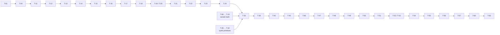
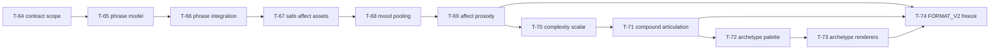

# dootdoot — Implementation Plan

> Derived from [`spec.md`](./spec.md) and [`design.md`](./design.md). Tasks are sized
> to **a few hours or less**. Each has a stable unique ID (**T-NN**), dependencies,
> related requirements, and an estimate. Phases are roughly sequential; within a phase,
> tasks may often run in parallel unless a dependency says otherwise.
>
> Legend: **Deps** = task IDs that must finish first. **Reqs** = requirement IDs
> covered. **Est** = rough effort.

> **Execution method — red-green TDD (mandatory for every task).** Each task below is
> implemented test-first: write a failing test that pins the behavior (**red**, confirm
> it fails for the right reason), write the minimum code to pass it (**green**), then
> **refactor** with the suite green. Task estimates already include writing the tests;
> "done" means the behavior is covered by a passing test at the appropriate level (value
> test, `proptest` invariant, `insta` snapshot, or golden-WAV hash — see
> [`style.md`](./style.md) §9). Where a task's deliverable _is_ a test harness or fixture
> (e.g. T-09/T-10, T-25, T-55–T-60), that test is the red step for the code it guards.
> Aim for roughly one red-green cycle per `jj` revision.

> **Progress tracking.** Every task is a checkbox. Check it off (`- [ ]` → `- [x]`) only
> when the task is genuinely done: its behavior is covered by a passing test (per the TDD
> rule above), it satisfies the listed **Reqs**, and it has landed in its own `jj`
> revision. Update the box in the same revision that completes the task, so this file
> stays the single source of truth for what's built. Don't check a box for partial or
> untested work.

---

## Phase 0 — Workspace & scaffolding

- [x] **T-01 — Initialize Cargo workspace.** Create the workspace `Cargo.toml` with members
      `dootdoot-core`, `dootdoot`, `xtask`. Set edition, shared lints, release profile
      (no fast-math, no FMA-contraction flags).
      Deps: — · Reqs: NFR-9 · Est: 1h
- [x] **T-02 — Scaffold `dootdoot-core` crate.** Library crate with empty module tree:
      `tokenizer`, `mapping`, `synth`, `mathx` (owned math), `wav`, `format`. Public API
      stubs. No deps yet.
      Deps: T-01 · Reqs: NFR-9, NFR-10 · Est: 1h
- [x] **T-03 — Scaffold `dootdoot` binary crate.** Binary depending on `dootdoot-core`;
      `main` stub.
      Deps: T-01 · Reqs: NFR-9 · Est: 0.5h
- [x] **T-04 — Scaffold `xtask` crate.** Build-time-only binary; add `model2vec-rs`,
      `nalgebra`/`linfa`, serialization deps here only.
      Deps: T-01 · Reqs: FR-40, NFR-6 · Est: 1h
- [x] **T-05 — CI skeleton.** GitHub Actions: build + test on macOS and Linux; cache cargo.
      Deps: T-01 · Reqs: NFR-17 · Est: 1.5h

---

## Phase 1 — Owned math (`mathx`) — needed early; everything downstream depends on it

- [x] **T-06 — Design `mathx` API + value tables.** Decide table sizes/polynomial degrees
      for `sin`, `exp`, `tanh`; document the determinism rationale.
      Deps: T-02 · Reqs: NFR-3 · Est: 1.5h
- [x] **T-07 — Implement `mathx::sin`/`cos`.** Range-reduction + polynomial/table, `f64`.
      Deps: T-06 · Reqs: NFR-3, NFR-5 · Est: 2.5h
- [x] **T-08 — Implement `mathx::exp` and `mathx::tanh`.** (tanh via exp.)
      Deps: T-06 · Reqs: NFR-3 · Est: 2.5h
- [x] **T-09 — `mathx` accuracy tests.** Compare to `std` within tolerance across the
      domain; assert no NaNs/inf at boundaries.
      Deps: T-07, T-08 · Reqs: NFR-19 · Est: 2h
- [x] **T-10 — `mathx` pinned-output tests.** Assert exact bit outputs at fixed sample
      points (regression guard / cross-platform anchor).
      Deps: T-07, T-08 · Reqs: NFR-2, NFR-19 · Est: 1.5h

---

## Phase 2 — Build-time asset generation (`xtask`)

- [x] **T-11 — Acquire `potion-base-8M` (upstream F32) + pin a source manifest.** Decide
      vendored-blob vs scripted download; place model + `tokenizer.json` under `assets/` (or a
      build cache). Commit `assets/source_manifest.toml` pinning HF repo, exact commit SHA,
      `model.safetensors`/`tokenizer.json` SHA-256, `hidden_dim=256`, `normalize=true`, dtype;
      have `xtask` validate the acquired files against it (and abort on mismatch) before doing
      any work. Document the choice. (dtype is build-time only; xtask emits its own int16
      artifact.)
      Deps: T-04 · Reqs: FR-5, FR-42, FR-43, NFR-8 · Est: 1.5h
- [x] **T-12 — Load model & extract all token embeddings.** Use `model2vec-rs` to read the
      ~30k × ~256 embedding matrix and per-token weights.
      Deps: T-11 · Reqs: FR-40 · Est: 2h
- [x] **T-13 — Compute top-4 PCA projection.** Center, SVD/PCA via `nalgebra`/`linfa`, keep
      4 components.
      Deps: T-12 · Reqs: FR-40 · Est: 2.5h
- [x] **T-14 — Canonicalize component signs.** Deterministic rule (largest-magnitude
      loading positive); unit-test reproducibility.
      Deps: T-13 · Reqs: FR-41 · Est: 1h
- [x] **T-15 — Choose squash function + compute per-axis stats.** Select the squash
      (tanh vs percentile-clamp) **here** — it determines which stats the header carries —
      and derive the per-axis stats over the full vocab. Document the choice; T-52 may revise
      it and regenerate the artifact before the freeze.
      Deps: T-14 · Reqs: FR-12 · Est: 1.5h
- [x] **T-16 — Define `format_v1.bin` binary layout.** Little-endian. Header (magic,
      version, vocab size, axis count, the 4 axis dequant scales + weight dequant scale as
      f32, squash stats, and model/tokenizer/PCA-matrix hashes) + per-token records
      (4×int16 quantized PCA + 1×int16 quantized weight = 10 bytes). The runtime file stores
      projected values, so it does NOT contain the PCA matrix. Document the layout.
      Deps: T-15 · Reqs: FR-10, FR-38 · Est: 1.5h
- [x] **T-17 — Serialize per-token 4-vectors + weights to `format_v1.bin`.** Project each
      token; quantize components and weight to int16 with the **symmetric signed, zero-point-
      free** rule (`s = max|·|/32767`, round-half-to-even, clamp to ±32767, code −32768
      unused; design.md §4.2); write the file; compute and embed model/tokenizer/PCA hashes.
      Unit-test the quantize↔dequantize round-trip and tie-rounding determinism.
      Deps: T-16 · Reqs: FR-9, FR-10, FR-40, FR-42 · Est: 2h
- [x] **T-18 — Commit `assets/format_v1.bin` + `tokenizer.json`.** Verify size (~300 KB)
      and add a regeneration README note.
      Deps: T-17 · Reqs: FR-42, NFR-7 · Est: 0.5h

---

## Phase 3 — Core mapping layer (`mapping`, `format`, `tokenizer`)

- [x] **T-19 — `format` module: load embedded artifact.** `include_bytes!` the table;
      parse header; expose PCA stats, squash stats, hashes, `FORMAT_V1` id.
      Deps: T-02, T-18 · Reqs: FR-9, FR-33, FR-38 · Est: 2h
- [x] **T-20 — `tokenizer` wrapper.** Wrap HF `tokenizers` with embedded `tokenizer.json`;
      `add_special_tokens=false`; expose token IDs + `##` continuation flags. Apply the
      control-token drop filter (`[PAD]`/`[CLS]`/`[SEP]`/`[MASK]` by ID, **keeping** `[UNK]`)
      so literal `"[MASK]"` etc. are dropped; test literal `"[CLS]"`/`"[MASK]"` and that
      filtered-to-empty routes to the chirp (design.md §3.3).
      Deps: T-02, T-18 · Reqs: FR-5, FR-6, FR-8 · Est: 2h
- [x] **T-21 — Token → 4-vector lookup.** Map IDs to baked vectors + weights; handle
      `[UNK]` via its own entry.
      Deps: T-19, T-20 · Reqs: FR-7, FR-9 · Est: 1h
- [x] **T-22 — Sequence pooling.** Token-weight-scaled mean of per-token 4-vectors →
      baseline vector: `(1/n) · Σ(wᵢ·vᵢ)`, denominator = token count `n`, **no L2 norm**
      (dootdoot-specific, not `model2vec.encode()`; design.md §4.2).
      Deps: T-21 · Reqs: FR-11 · Est: 1h
- [x] **T-23 — Axis squash.** Implement chosen squash using frozen stats + `mathx`; apply
      per-token and to baseline.
      Deps: T-22, T-08 · Reqs: FR-12 · Est: 1.5h
- [x] **T-24 — Knob assembly.** Per axis `k`: `knob = clamp(B_k + α_k·(T_{k}−B_k),
lo_k, hi_k)` where `B_k`/`T_k` are the squashed baseline/per-token knobs and `α_k` is the
      frozen modulation depth (design.md §5.4). Produce the per-syllable knob set {pitch, vowel,
      contour, warble} in fixed axis order; test single-token (`knob==B_k`) and clamp at bounds.
      Deps: T-23 · Reqs: FR-13, FR-14, FR-18 · Est: 1.5h
- [x] **T-25 — Semantic-sanity tests.** Assert `cat↔dog` < `cat↔airplane` (token) and
      analogous sequence-level ordering.
      Deps: T-24 · Reqs: NFR-14, NFR-15 · Est: 1.5h

---

## Phase 4 — Synthesis engine (`synth`)

- [x] **T-26 — Define fixed synthesis constants.** Initial values for formant freqs/vowel
      locus, glide time, warble rate, ring-mod freq/mix, envelope, register bias,
      durations, pauses. (Refined in Phase 7.)
      Deps: T-02 · Reqs: FR-17, FR-22, FR-24 · Est: 1.5h
- [x] **T-27 — Harmonically-rich source oscillator.** Band-limited saw/pulse via `mathx`.
      Deps: T-07, T-26 · Reqs: FR-16 · Est: 2h
- [x] **T-28 — Formant filter bank.** 2–3 resonant bandpasses; vowel position parameter
      steers center frequencies.
      Deps: T-27 · Reqs: FR-16, FR-18 · Est: 2.5h
- [x] **T-29 — Pitch model: register bias + portamento + contour.** Smooth glide between
      syllables; contour shape applied per gesture.
      Deps: T-27 · Reqs: FR-16, FR-18, FR-19 · Est: 2.5h
- [x] **T-30 — Warble LFO.** Fixed-rate vibrato on pitch; depth from warble knob.
      Deps: T-29, T-07 · Reqs: FR-16, FR-18 · Est: 1h
- [x] **T-31 — Ring-mod + amplitude envelope.** Faint fixed ring-mod; snappy fixed AD
      envelope per syllable.
      Deps: T-27, T-07 · Reqs: FR-16, FR-17 · Est: 1.5h
- [x] **T-32 — Single-syllable renderer.** Compose the signal graph into one syllable
      buffer (`f64`): pitch model (center+portamento+warble) drives the oscillator/source →
      formant bank → ring-mod → amplitude envelope (design.md §6.2).
      Deps: T-28, T-29, T-30, T-31 · Reqs: FR-15, FR-16 · Est: 2h
- [x] **T-33 — Utterance sequencer.** Lay out syllables with intra-word glides, inter-word
      pauses, punctuation intonation, leading/trailing padding. Punctuation attaches
      **backward only**: leading/standalone markers are dropped (no forward attach); only the
      first of consecutive markers shapes the prior glide; input with zero voiced syllables
      after filtering routes to the "?" chirp (design.md §6.4).
      Deps: T-32, T-24 · Reqs: FR-21, FR-22, FR-23, FR-24 · Est: 2.5h
- [x] **T-34 — Fixed "?" chirp gesture.** Hardcoded inquisitive rising-glide for empty
      input.
      Deps: T-32 · Reqs: FR-4 · Est: 1h

---

## Phase 5 — Output buffer & WAV (`wav`)

- [x] **T-35 — Float→i16 quantization.** Single fixed rounding rule (no dither); clamp.
      Deps: T-02 · Reqs: FR-25, FR-29, NFR-4 · Est: 1h
- [x] **T-36 — Canonical buffer assembly.** Produce one `Vec<i16>` @ 44.1k mono as the
      sole source of truth.
      Deps: T-33, T-35 · Reqs: FR-25, FR-30 · Est: 1h
- [x] **T-37 — WAV writer via `hound`.** Serialize the canonical buffer to 44.1k/16-bit/
      mono WAV.
      Deps: T-36 · Reqs: FR-26, FR-29 · Est: 1h

---

## Phase 6 — CLI binary (`dootdoot`)

- [x] **T-38 — `clap` argument model.** Positional `TEXT`, `-o/--output`, `--play`,
      `--explain`, `--version` (shows `FORMAT_V1`), `--help`.
      Deps: T-03 · Reqs: FR-1, FR-31, FR-33, FR-34 · Est: 1.5h
- [x] **T-39 — Input resolution.** Arg vs piped stdin vs interactive TTY; empty/whitespace
      → chirp path.
      Deps: T-38, T-34 · Reqs: FR-2, FR-3, FR-4 · Est: 1.5h
- [x] **T-40 — Output routing.** Implement no-`-o`→play, `-o`→write, `-o --play`→both.
      Deps: T-38, T-36, T-37 · Reqs: FR-26, FR-27, FR-28 · Est: 1h
- [x] **T-41 — Live playback via `rodio`.** Stream the canonical buffer; CoreAudio on Mac.
      Sub-second time-to-first-sound is an architectural guarantee of the no-tensor-runtime
      design (embedded table, no model load), not a tuned hot path.
      Deps: T-36 · Reqs: FR-27, FR-30, NFR-12, NFR-13 · Est: 1.5h
- [x] **T-42 — `--explain` table.** Per-token `token │ pitch │ vowel │ contour │ warble`
      to stderr, with prosodic punctuation shown as distinct control rows.
      Deps: T-24, T-38 · Reqs: FR-31, FR-32, FR-23a · Est: 1.5h
- [x] **T-43 — Input limits.** Warn past ≈8 min/≈40 MB (≈2,000 tokens); hard error before
      synthesis past the ≈30 min/≈160 MB ceiling (≈8,000 tokens), no audio. Byte/duration is
      the normative bound; token count is a derived pre-check (design.md §10).
      Deps: T-39, T-20 · Reqs: FR-36, FR-37 · Est: 1h
- [x] **T-44 — Exit codes & error messages.** Friendly stderr errors; correct exit codes.
      Deps: T-39, T-40 · Reqs: FR-35 · Est: 1h

---

## Phase 7 — Voice tuning (freeze the sound)

> **Tuning decomposition.** T-45…T-50 were inserted after
> [`bb8-sound-signature-analysis.md`](./research/bb8-sound-signature-analysis.md) to split the
> original broad T-45 tuning pass into implementation-sized, testable voice-DNA changes
> while keeping completed task IDs stable. Metrics are directional aids only; by-ear review
> remains the final acceptance gate for T-51.

- [x] **T-45 — Establish BB-8 comparison corpus + metrics harness.** Keep a small local
      reference/dootdoot comparison workflow for Phase 7 tuning: decode the downloaded BB-8 clips to
      mono 44.1 kHz, render a fixed dootdoot phrase corpus, and report the directional metrics
      from the analysis doc (active fraction/islands, magnitude-spectrum centroid/85% rolloff,
      dominant-peak motion, harmonicity, and broad power bands). Document that the active-island
      metrics are gate-dependent and that BB-8 brightness mainly lives in the 2–5 kHz upper-mid
      region, not >6 kHz. This is a tuning aid, not a golden contract.
      Deps: T-40, T-41 · Reqs: NFR-16 · Est: 1.5h
- [x] **T-46 — Add internal pitch and vowel trajectories.** Give every syllable a fixed
      deterministic micro-gesture even when there is no neighboring token: an internal pitch
      swoop layered with existing inter-token portamento, plus a time-varying vowel/formant
      trajectory around the semantic vowel target. Add focused tests for deterministic trajectory
      endpoints/ranges and keep all motion inside the fixed droid parameter space.
      Deps: T-32, T-33, T-45 · Reqs: FR-15, FR-16, FR-18, FR-19, NFR-16 · Est: 2.5h
- [x] **T-47 — Add deterministic transient/body/upper-mid layers.** Keep the pitched
      formant core, but add bounded deterministic layers that make each gesture less like a single
      clean oscillator: attack transient/noise, optional low body around the 300–700 Hz region,
      and gesture-shaped upper-mid sparkle primarily in the 2–5 kHz band. Avoid unseeded
      randomness and keep >6 kHz content modest because the references carry little energy there.
      Add tests for determinism, bounded output, and no silent/NaN paths.
      Deps: T-46 · Reqs: FR-16, FR-17, NFR-3, NFR-4, NFR-16 · Est: 2.5h
- [x] **T-48 — Rebalance register, pitch span, and formants.** Tune the fixed pitch bias/span,
      formant gains/Q/loci, and source mix so dootdoot no longer over-focuses the 500–2000 Hz
      band and has more BB-8-like body plus upper-mid brightness. Preserve the semantic axis
      mapping and add regression tests for pitch/formant bounds and sample determinism.
      Deps: T-47 · Reqs: FR-13, FR-16, FR-17, FR-18, NFR-16 · Est: 2h
- [x] **T-49 — Replace simple sine warble with compound deterministic modulation.** Move from a
      per-syllable 8.5 Hz sine vibrato to a richer deterministic LFO stack (slow drift + faster
      flutter) whose phase/position handling avoids every token beginning identically. The
      semantic warble knob scales amount/complexity while remaining bounded. Add tests for
      deterministic phase behavior and knob-range limits.
      Deps: T-48 · Reqs: FR-16, FR-18, NFR-3, NFR-16 · Est: 2h
- [x] **T-50 — Rework envelope and phrasing templates.** Replace the simple ADSR-like gate with
      a droid gesture envelope: asymmetric attack, internal pulse/dip, and deterministic tail.
      Adjust fixed syllable/pause/tail timing only as needed to reduce active density and create
      more phrase air; update exact sample-count estimation and input-limit tests for any timing
      changes. Preserve deterministic timing templates, not runtime randomness.
      Deps: T-49, T-43 · Reqs: FR-21, FR-22, FR-24, FR-36, FR-37, NFR-16 · Est: 2h
- [x] **T-51 — Final integrated BB-8 tuning pass.** Tune by ear across varied text and the local
      BB-8 reference clips after the layered voice changes land. Use the T-45 metrics to confirm
      directionally improved body, upper-mid brightness, gesture motion, harmonicity, and phrase
      air, but accept/reject by listening for reliable BB-8-family identity.
      Deps: T-45, T-46, T-47, T-48, T-49, T-50 · Reqs: NFR-16 · Est: 3h
- [x] **T-52 — Validate/finalize squash; regenerate artifact if changed.** Confirm the
      squash chosen at T-15 still lands tastefully after by-ear tuning; if it (or its stats)
      changes, **re-run `xtask` to regenerate `format_v1.bin`** (header stats only — baked
      vectors are pre-squash) before the freeze. Lock into `FORMAT_V1`.
      Deps: T-51, T-23, T-15 · Reqs: FR-12, FR-39 · Est: 1.5h
- [x] **T-53 — Validate learnability spread.** Spot-check that distinct semantic clusters
      are audibly distinct and similar ones audibly similar; adjust axis ranges if needed.
      Deps: T-51 · Reqs: NFR-14, NFR-15, NFR-16 · Est: 2h
- [x] **T-54 — Lock `FORMAT_V1`.** Finalize all constants/hashes; assert version surfaced
      by `--version`; document that further output changes require `V2`.
      Deps: T-52, T-53 · Reqs: FR-38, FR-39 · Est: 1h

---

## Phase 8 — Test suite & determinism contract

- [x] **T-55 — Define golden corpus.** Fix inputs: `""`, `"hello"`, `"hello there"`,
      `"playing"`, `"cat"`, `"dog"`, `"airplane"`, `"?"`, punctuation, `[UNK]` triggers,
      a long input.
      Deps: T-54 · Reqs: NFR-17 · Est: 1h
- [x] **T-56 — Generate & commit golden WAV hashes.** SHA-256 of each corpus output (after
      freeze).
      Deps: T-55 · Reqs: NFR-17 · Est: 1h
- [x] **T-57 — Golden-WAV hash test.** Assert outputs match committed hashes; wire into CI
      on macOS + Linux.
      Deps: T-56, T-05 · Reqs: NFR-1, NFR-2, NFR-17 · Est: 1.5h
- [x] **T-58 — Double-run determinism test.** Each corpus input twice → byte-identical.
      Deps: T-55 · Reqs: NFR-1, NFR-18 · Est: 1h
- [x] **T-59 — `--explain` snapshot test.** Golden snapshot of the table for a fixed input.
      Deps: T-42 · Reqs: NFR-20 · Est: 1h
- [x] **T-60 — Cross-platform verification.** Confirm identical hashes on macOS and Linux
      in CI; investigate/fix any divergence (math path).
      Deps: T-57 · Reqs: NFR-2, NFR-3, NFR-5 · Est: 2h

---

## Phase 9 — Documentation & packaging

- [x] **T-61 — README + usage docs.** Examples, the documented behaviors (uncased,
      English-oriented, "?" chirp, limits), and `--explain` walkthrough.
      Deps: T-44 · Reqs: NFR-21 · Est: 2h
- [x] **T-62 — Asset regeneration guide.** How to re-run `xtask` and when a `V2` bump is
      required.
      Deps: T-18, T-54 · Reqs: FR-39, FR-40 · Est: 1h
- [x] **T-63 — Packaging.** `cargo install` support; optional Homebrew formula / prebuilt
      release binaries; choose license.
      Deps: T-60 · Reqs: NFR-11 · Est: 2.5h

---

## Phase 10 — FORMAT_V2 expressiveness backlog

> Derived from
> [`bb8-expressiveness-gap-analysis.md`](./research/bb8-expressiveness-gap-analysis.md).
> This is a post-`FORMAT_V1` backlog, not part of the v1 release path. The intended order
> follows the analysis: phrase prosody first, then licensing-safe affect, then complexity,
> then gesture archetypes. Every sample-affecting task here requires `FORMAT_V2` and a new
> golden fixture set.

- [x] **T-64 — Decide FORMAT_V2 contract scope and NFR-16 broadening.** Update
      `design.md`/`spec.md` so the v2 contract can include a fixed set of deterministic,
      bounded performance channels: semantic axes, phrase timing, affect, complexity, and
      a small archetype dimension. Keep the four semantic axes as the learnable core and
      document that any new channel is deterministic, bounded, and surfaced in
      `--explain` where useful.
      Deps: T-54 · Reqs: FR-38, FR-39, NFR-16 · Est: 1.5h
- [x] **T-65 — Add a phrase-prosody planner model.** Create a pure planner that turns the
      token/control-event stream into phrase metadata: boundary strength, declination
      offset, pitch reset, final lowering, pre-boundary lengthening scale, pause length,
      and sparse emphasis. Pin behavior with value tests and `insta` snapshots before
      wiring it into synthesis.
      Deps: T-64 · Reqs: FR-20, FR-22, FR-23, FR-24, NFR-16 · Est: 2.5h
- [x] **T-66 — Integrate phrase prosody into sequencing and synthesis.** Apply the
      phrase plan to variable pauses, pre-boundary lengthening, phrase-level pitch offsets,
      and sparse emphasis. Update output-length estimation, input-limit tests, and
      `FORMAT_V2` golden hashes once the constants are frozen.
      Deps: T-65 · Reqs: FR-20, FR-22, FR-24, FR-36, FR-37, FR-38, FR-39, NFR-16 · Est: 3h
- [x] **T-67 — Add licensing-safe affect assets.** Bake VADER (MIT) valence and an
      owned arousal proxy from punctuation density, repeated markers, all-caps,
      hand-curated intensifiers, token count, and character/WordPiece complexity. Do not
      commit AFINN, SentiWordNet, SUBTLEX-US, NRC-VAD, Warriner, Zipf, or VAD-derived
      tables until an explicit asset-license policy exists.
      Deps: T-66 · Reqs: FR-38, FR-40, FR-42, FR-43, NFR-8 · Est: 2h
- [x] **T-68 — Pool affect into an utterance mood.** Compute deterministic valence and
      arousal scores per token/phrase, pool them into an utterance-level mood, and add
      tests for punctuation/case/intensifier-driven arousal plus negative/positive
      valence examples.
      Deps: T-67 · Reqs: FR-38, FR-39, NFR-16 · Est: 2h
- [x] **T-69 — Drive prosody from affect and expose mood in `--explain`.** Map arousal to
      rate, pitch register, pitch range, brightness, warble amount, and sub-gesture
      density; map valence to contour direction and darker/brighter voice quality. Add
      an `--explain` mood row and snapshots for sad, excited, calm, and alarm-like text.
      Deps: T-66, T-68 · Reqs: FR-31, FR-32, FR-38, FR-39, NFR-16, NFR-20 · Est: 3h
- [x] **T-70 — Add a first-pass complexity scalar.** Start with deterministic signals the
      project already owns: WordPiece subtoken count and character length. Gate optional
      Zipf/frequency or iconicity inputs behind the same asset-license policy as affect.
      Add tests showing common short words remain simple while longer/rarer shapes score
      higher.
      Deps: T-69 · Reqs: FR-8, FR-15, FR-38, FR-39, NFR-16 · Est: 2h
- [x] **T-71 — Render complexity as compound articulation.** Use the complexity scalar to
      choose internal sub-gesture count, articulation density, and optional deterministic
      duration scaling without changing the semantic meaning-timbre. Update synthesis,
      output-length estimation, and golden hashes under `FORMAT_V2`.
      Deps: T-70 · Reqs: FR-15, FR-20, FR-36, FR-37, FR-38, FR-39, NFR-16 · Est: 3h
- [x] **T-72 — Define the bounded archetype palette and selection rule.** Specify the
      deterministic palette (`chatter`, `yelp`, `moan`, `stutter/burst`, `tremble`, plus
      sparing non-vocal seasoning) and test that selection is a pure function of affect,
      complexity, punctuation, and phrase position rather than free variation.
      Deps: T-71 · Reqs: FR-15, FR-16, FR-17, FR-18, FR-38, FR-39, NFR-16 · Est: 2.5h
- [x] **T-73 — Implement archetype renderers and texture seasoning.** Add bounded yelp,
      moan, stutter/burst, and tremble render paths plus sparse servo/noise-tail texture.
      Keep all paths deterministic, finite, and inside the BB-8-family parameter space.
      Deps: T-72 · Reqs: FR-16, FR-17, FR-18, NFR-3, NFR-4, NFR-16 · Est: 3h
- [ ] **T-74 — Freeze FORMAT_V2 expressiveness and acceptance aids.** Extend the Phase 7
      metrics workflow with contextual-clip directional checks from the expressiveness
      analysis, run by-ear acceptance, update `--version`, regenerate v2 golden WAV
      hashes, and document the final phrase/affect/complexity/archetype contract.
      Deps: T-69, T-71, T-73 · Reqs: FR-33, FR-38, FR-39, NFR-17, NFR-18, NFR-20 · Est: 3h

---

## Critical paths

Owned math (T-06–T-10) and the synth primitives (T-26–T-32) proceed in parallel and
converge at T-33. Tuning now runs through the BB-8 comparison/tuning breakdown
(T-45–T-50) before the final by-ear T-51 acceptance pass. Tuning must precede freezing
(T-54), which gates all golden-file tests (Phase 8).

The `FORMAT_V2` expressiveness branch is intentionally separate from v1 packaging:

